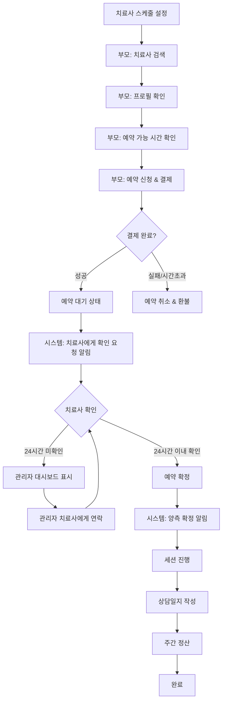
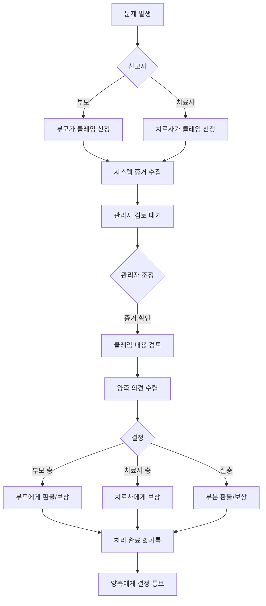
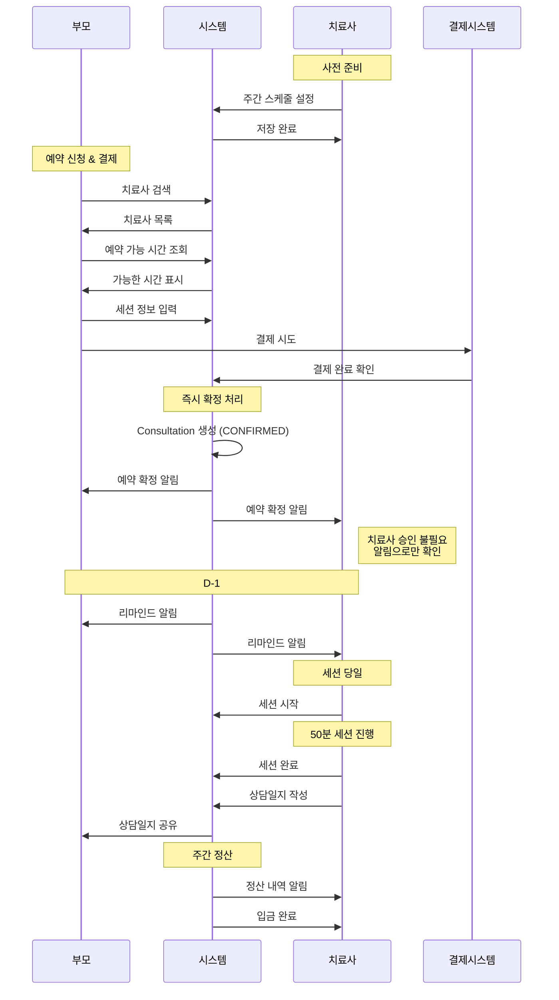
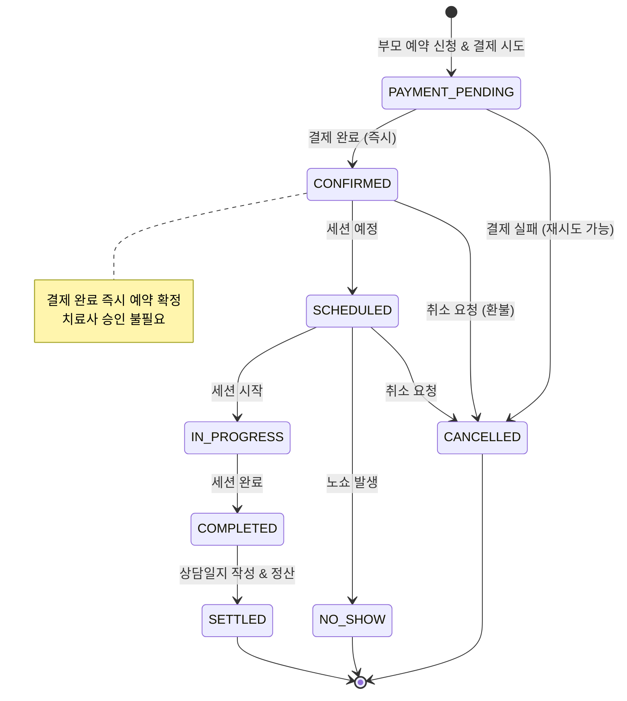
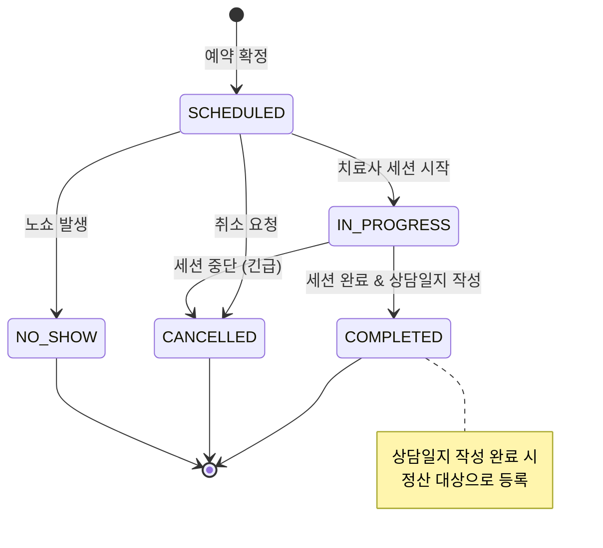
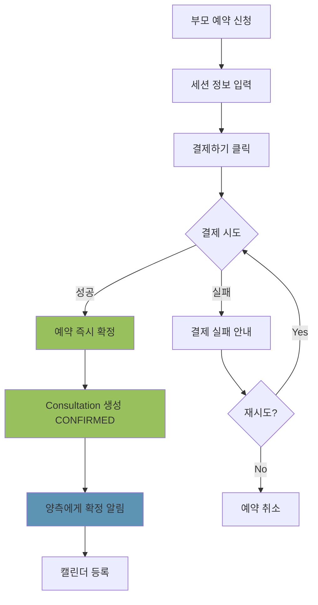
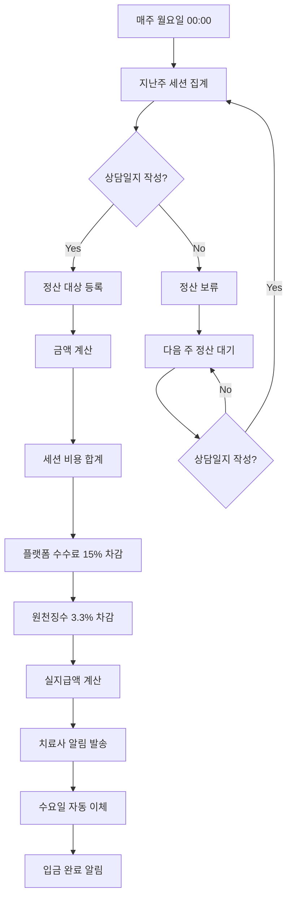

# 치료사 예약 시스템 통합 Workflow

## 목차
1. [전체 프로세스 개요](#1-전체-프로세스-개요)
2. [역할별 상세 플로우](#2-역할별-상세-플로우)
3. [세부 시나리오](#3-세부-시나리오)
4. [데이터 구조](#4-데이터-구조)
5. [API 엔드포인트](#5-api-엔드포인트)
6. [예외 처리 플로우](#6-예외-처리-플로우)
7. [알림 시스템](#7-알림-시스템)
8. [다이어그램](#8-다이어그램)

---

## 1. 전체 프로세스 개요

### 1.1 전체 흐름 요약



### 1.2 주요 단계별 소요 시간

| 단계 | 담당 | 소요 시간 | 비고 |
|------|------|-----------|------|
| 스케줄 일괄 생성 | 치료사 | 최초 1회 10분 | 3개월분 한번에 생성 |
| 휴일 관리 | 치료사 | 수시 1-2분 | 개인 휴일 추가 |
| 치료사 검색 | 부모 | 5-10분 | 필터링 사용 시 빠름 |
| 예약 신청 & 결제 | 부모 | 5-10분 | 결제 완료 시 대기 상태 |
| 치료사 예약 확인 | 치료사 | 24시간 이내 | 미확인 시 관리자 개입 |
| 세션 진행 | 치료사 | 50분 | 표준 세션 시간 |
| 상담일지 작성 | 치료사 | 10-15분 | 정산 조건 |
| 정산 처리 | 시스템 | 매주 자동 | 월요일 계산, 수요일 입금 |

---

## 2. 역할별 상세 플로우

### 2.0 치료사 온보딩 (회원가입 및 승인)

#### 2.0.1 치료사 회원가입 프로세스

```
치료사가 회원가입 페이지 방문
  ↓
[치료사로 가입하기] 버튼 클릭
  ↓
1단계: 기본 정보 입력
  ┌─────────────────────────────────────┐
  │ 치료사 회원가입 (1/3)               │
  ├─────────────────────────────────────┤
  │ 기본 정보                           │
  │                                     │
  │ 이름: [_________]                   │
  │                                     │
  │ 성별:                               │
  │ ○ 남성  ● 여성  ○ 기타             │
  │                                     │
  │ 생년: [1990]년                      │
  │                                     │
  │ 전화번호: [010-____-____]           │
  │                                     │
  │ 이메일: [_________@___.___ ]        │
  │                                     │
  │ 주소:                               │
  │ [우편번호 검색]                     │
  │ [서울시 강남구 ...]                 │
  │ 상세주소: [_________]               │
  │                                     │
  │ [다음 단계]                         │
  └─────────────────────────────────────┘
  ↓
2단계: 전문 정보 입력
  ┌─────────────────────────────────────┐
  │ 치료사 회원가입 (2/3)               │
  ├─────────────────────────────────────┤
  │ 전문 정보                           │
  │                                     │
  │ 치료 분야: (중복 선택 가능)         │
  │ ☑ 언어치료                          │
  │ ☑ 감각통합                          │
  │ ☐ 놀이치료                          │
  │ ☐ 미술치료                          │
  │ ☐ 음악치료                          │
  │ ☐ 작업치료                          │
  │ ☐ 인지치료                          │
  │ ☐ 행동치료                          │
  │                                     │
  │ 치료 가능 아이 나이: (중복 가능)    │
  │ ☑ 0-12개월                          │
  │ ☑ 13-24개월                         │
  │ ☑ 25-36개월                         │
  │ ☐ 37-48개월                         │
  │ ☐ 49-60개월                         │
  │ ☐ 5-7세                             │
  │ ☐ 8세 이상                          │
  │                                     │
  │ 치료 가능 지역: (중복 가능)         │
  │ 서울특별시                          │
  │ ☑ 강남구  ☑ 서초구  ☐ 송파구      │
  │ ☐ 강동구  ☑ 광진구  ☐ 성동구      │
  │ ☐ 용산구  ☐ 중구    ☐ 종로구      │
  │ [더 보기 ▼]                         │
  │                                     │
  │ 세션 비용:                          │
  │ 50분 기준: [80,000]원               │
  │                                     │
  │ [이전] [다음 단계]                  │
  └─────────────────────────────────────┘
  ↓
3단계: 자격 및 경력 입력
  ┌─────────────────────────────────────┐
  │ 치료사 회원가입 (3/3)               │
  ├─────────────────────────────────────┤
  │ 자격증                              │
  │                                     │
  │ 자격증 1                            │
  │ 자격증명: [언어치료사 1급]          │
  │ 발급기관: [한국언어치료사협회]      │
  │ 취득일: [2018-03-15]                │
  │ 자격증 사본: [파일 업로드]          │
  │   └ certificate1.pdf ✅            │
  │                                     │
  │ [+ 자격증 추가]                     │
  │                                     │
  │ ─────────────────────────────────   │
  │ 경력                                │
  │                                     │
  │ 경력 1                              │
  │ 근무형태:                           │
  │ ● 기관  ○ 프리랜서                  │
  │                                     │
  │ 기관명: [OO발달센터]                │
  │ 치료분야: [언어치료]                │
  │ 재직기간:                           │
  │   시작: [2018-04] 종료: [2022-12]   │
  │ 설명: [영유아 언어발달 전담...]     │
  │                                     │
  │ [+ 경력 추가]                       │
  │                                     │
  │ ─────────────────────────────────   │
  │ 약관 동의                           │
  │ ☑ 서비스 이용약관 (필수)            │
  │ ☑ 개인정보 처리방침 (필수)          │
  │ ☑ 위치정보 이용약관 (필수)          │
  │ ☐ 마케팅 정보 수신 (선택)           │
  │                                     │
  │ [이전] [가입 신청]                  │
  └─────────────────────────────────────┘
  ↓
[가입 신청] 클릭
  ↓
시스템 처리:
  1. User 레코드 생성
     - role: THERAPIST
     - status: PENDING_APPROVAL
  2. TherapistProfile 레코드 생성
     - 모든 입력 정보 저장
     - approvalStatus: PENDING
  3. Certification 레코드 생성 (자격증)
  4. Experience 레코드 생성 (경력)
  5. 파일 업로드 (자격증 사본)
  6. 관리자에게 신규 가입 알림
  7. 치료사에게 확인 이메일 발송
  ↓
가입 완료 화면
  ┌─────────────────────────────────────┐
  │ ✅ 가입 신청이 완료되었습니다!       │
  ├─────────────────────────────────────┤
  │ 회원가입이 성공적으로 완료되었습니다│
  │                                     │
  │ 관리자 승인 후 서비스를 이용하실 수 │
  │ 있습니다.                           │
  │                                     │
  │ 승인 소요 시간: 1-3 영업일          │
  │                                     │
  │ 승인 결과는 이메일과 SMS로          │
  │ 안내해드립니다.                     │
  │                                     │
  │ [확인]                              │
  └─────────────────────────────────────┘
```

#### 2.0.2 관리자 승인 프로세스

```
관리자 대시보드
  ↓
[치료사 관리] 메뉴
  ↓
[승인 대기] 탭
  ┌─────────────────────────────────────┐
  │ 🔔 승인 대기 중인 치료사 (3명)      │
  ├─────────────────────────────────────┤
  │ 신청일자: 2025-10-12 14:30         │
  │ 이름: 김XX                          │
  │ 치료분야: 언어치료, 감각통합        │
  │ 경력: 4년 6개월                     │
  │ 상태: 검토 대기                     │
  │ [상세보기]                          │
  │                                     │
  │ ─────────────────────────────────   │
  │                                     │
  │ 신청일자: 2025-10-11 09:15         │
  │ 이름: 이OO                          │
  │ 치료분야: 놀이치료                  │
  │ 경력: 2년 3개월                     │
  │ 상태: 검토 대기                     │
  │ [상세보기]                          │
  └─────────────────────────────────────┘
  ↓
[상세보기] 클릭
  ↓
치료사 신청 상세 화면
  ┌─────────────────────────────────────┐
  │ 치료사 가입 신청 상세               │
  ├─────────────────────────────────────┤
  │ 📋 기본 정보                        │
  │ - 이름: 김XX                        │
  │ - 성별: 여성                        │
  │ - 생년: 1990년                      │
  │ - 전화번호: 010-1234-5678           │
  │ - 이메일: therapist@example.com     │
  │ - 주소: 서울시 강남구 테헤란로...   │
  │                                     │
  │ 💼 전문 정보                        │
  │ - 치료분야: 언어치료, 감각통합      │
  │ - 치료 가능 나이: 0-12개월,         │
  │                  13-24개월, 25-36개월│
  │ - 치료 가능 지역: 강남구, 서초구,   │
  │                  광진구             │
  │ - 세션 비용: ₩80,000 (50분)        │
  │                                     │
  │ 📜 자격증 (2개)                     │
  │ 1. 언어치료사 1급                   │
  │    발급: 한국언어치료사협회         │
  │    취득일: 2018-03-15               │
  │    [사본 보기] certificate1.pdf     │
  │                                     │
  │ 2. 감각통합치료사                   │
  │    발급: 대한감각통합치료학회       │
  │    취득일: 2019-07-20               │
  │    [사본 보기] certificate2.pdf     │
  │                                     │
  │ 💼 경력 (2개)                       │
  │ 1. OO발달센터 (기관)                │
  │    분야: 언어치료                   │
  │    기간: 2018-04 ~ 2022-12 (4년 8개월)│
  │    설명: 영유아 언어발달 전담       │
  │                                     │
  │ 2. 프리랜서                         │
  │    분야: 언어치료, 감각통합         │
  │    기간: 2023-01 ~ 현재 (1년 9개월) │
  │    설명: 가정 방문 치료             │
  │                                     │
  │ 총 경력: 6년 5개월                  │
  │                                     │
  │ ─────────────────────────────────   │
  │ 관리자 메모                         │
  │ [자격증 확인 완료. 경력 검증 필요]  │
  │                                     │
  │ 승인 결정:                          │
  │ ● 승인                              │
  │ ○ 반려                              │
  │ ○ 추가 자료 요청                    │
  │                                     │
  │ 반려 사유 (반려 선택 시):           │
  │ [________________]                  │
  │                                     │
  │ 추가 요청 사항 (추가 자료 선택 시): │
  │ [________________]                  │
  │                                     │
  │ [승인 처리] [반려 처리]             │
  └─────────────────────────────────────┘
  ↓
[승인 처리] 클릭
  ↓
시스템 자동 처리:
  1. TherapistProfile 업데이트
     - approvalStatus: APPROVED
     - approvedAt: 현재 시각
     - approvedBy: 관리자 ID
  2. User 상태 업데이트
     - status: ACTIVE
  3. 치료사에게 승인 알림
     - 이메일: "가입이 승인되었습니다!"
     - SMS: "AI포텐 치료사 가입이 승인되었습니다"
     - 푸시: "로그인하여 스케줄을 설정해주세요"
  4. 초기 설정 가이드 발송
  ↓
완료
```

**반려 처리 시:**
```
[반려 처리] 클릭
  ↓
시스템 자동 처리:
  1. TherapistProfile 업데이트
     - approvalStatus: REJECTED
     - rejectedAt: 현재 시각
     - rejectedBy: 관리자 ID
     - rejectionReason: 입력한 사유
  2. User 상태 업데이트
     - status: REJECTED
  3. 치료사에게 반려 알림
     - 이메일: "가입 신청이 반려되었습니다"
     - 반려 사유 포함
     - 재신청 안내
  ↓
완료
```

**추가 자료 요청 시:**
```
[추가 자료 요청] 선택 → [요청 발송]
  ↓
시스템 자동 처리:
  1. TherapistProfile 업데이트
     - approvalStatus: PENDING_ADDITIONAL_INFO
     - additionalInfoRequested: 요청 내용
  2. 치료사에게 알림
     - 이메일: "추가 자료 제출이 필요합니다"
     - 요청 내용 포함
     - 자료 제출 링크
  ↓
치료사가 추가 자료 제출
  ↓
다시 관리자 검토 대기 상태로 전환
```

#### 2.0.3 치료사 승인 후 초기 설정

```
치료사 로그인
  ↓
대시보드 진입
  ┌─────────────────────────────────────┐
  │ 👋 환영합니다, 김XX 치료사님!        │
  ├─────────────────────────────────────┤
  │ 🎉 가입이 승인되었습니다!            │
  │                                     │
  │ 서비스 이용을 위해 다음 단계를      │
  │ 완료해주세요:                       │
  │                                     │
  │ ☐ 1. 프로필 사진 등록               │
  │ ☐ 2. 자기소개 작성                  │
  │ ☐ 3. 스케줄 설정                    │
  │ ☐ 4. 정산 계좌 등록                 │
  │                                     │
  │ [시작하기]                          │
  └─────────────────────────────────────┘
  ↓
초기 설정 완료 후 정상 서비스 이용 가능
```

### 2.1 치료사 (사전 준비)

#### A. 스케줄 일괄 생성

```
치료사 대시보드
  ↓
[스케줄 관리] 메뉴
  ↓
[일괄 생성] 버튼
  ┌─────────────────────────────────────┐
  │ 스케줄 일괄 생성                    │
  ├─────────────────────────────────────┤
  │ 생성 기간:                          │
  │ 시작: [2025-10-15]                  │
  │ 종료: [2025-12-31] (최대 3개월)     │
  │                                     │
  │ 요일별 시간 설정:                   │
  │ ☑ 월: 09:00-12:00, 14:00-18:00     │
  │ ☑ 화: 09:00-12:00, 14:00-18:00     │
  │ ☐ 수: (휴무)                        │
  │ ☑ 목: 09:00-12:00, 14:00-18:00     │
  │ ☑ 금: 09:00-12:00, 14:00-18:00     │
  │ ☑ 토: 10:00-14:00                   │
  │ ☐ 일: (휴무)                        │
  │                                     │
  │ 세션 설정:                          │
  │ - 세션 시간: ● 50분 ○ 80분         │
  │ - 동시 예약 수: [2] 명              │
  │                                     │
  │ 옵션:                               │
  │ ☑ 휴일 제외 (공휴일 + 개인 휴일)    │
  │                                     │
  │ 예상 생성 슬롯: 약 240개            │
  │                                     │
  │ [생성하기]                          │
  └─────────────────────────────────────┘
  ↓
생성 처리 (5-10초)
  ↓
"240개의 예약 슬롯이 생성되었습니다"
  ↓
캘린더 뷰에서 확인 가능
```

**주요 기능:**
- 최대 3개월까지 일괄 생성
- 요일별 시간 패턴 설정
- 동시 예약 수 설정 (1~5명)
- 휴일 자동 제외
- 생성 후 개별 수정 가능

**일괄 삭제:**
```
[일괄 삭제] 버튼
  ↓
기간 선택 → 빈 슬롯만 삭제
  (예약이 있는 슬롯은 보호)
```

#### B. 휴일 관리

```
[휴일 관리] 메뉴
  ↓
  ┌─────────────────────────────────────┐
  │ 휴일 관리                           │
  ├─────────────────────────────────────┤
  │ 등록된 휴일:                        │
  │ • 2025-10-25 (개인 사유)            │
  │ • 2025-11-15~17 (가족 여행)         │
  │ • 2025-12-25 (크리스마스)           │
  │                                     │
  │ [새 휴일 추가]                      │
  │                                     │
  │ 유형: ● 단일 날짜 ○ 기간            │
  │ 날짜: [2025-12-31]                  │
  │ 사유: [연말 휴무]                   │
  │                                     │
  │ [추가하기]                          │
  │                                     │
  │ 국가 공휴일:                        │
  │ ☑ 자동으로 공휴일 적용              │
  │   (설날, 추석, 광복절 등)           │
  └─────────────────────────────────────┘
  ↓
휴일 저장
  ↓
해당 날짜 슬롯 자동 비활성화
  (예약 있으면 경고)
```

**주요 기능:**
- 단일 날짜 또는 기간 설정
- 개인 휴일 자유 등록
- 국가 공휴일 자동 적용
- 휴일 날짜는 예약 불가
- 이미 예약이 있으면 변경 협의 필요

#### C. 예약 확정 알림 수신 (자동)

```
부모가 예약 & 결제 완료 (자동)
  ↓
새 예약 확정 알림 (즉시)
  "새로운 예약이 확정되었습니다"
  ↓
예약 상세 확인
  ┌─────────────────────────────────────┐
  │ 새 예약 정보                        │
  ├─────────────────────────────────────┤
  │ 예약 일시: 2025-10-05 (토) 14:00   │
  │                                     │
  │ 아이: OO이 (24개월, 남아)           │
  │ 발달 체크 결과:                     │
  │  - 언어: 주의 (45점)                │
  │  - 인지: 양호 (72점)                │
  │  - 기타 영역: 우수                  │
  │                                     │
  │ 방문 주소: 서울시 강남구 XX동       │
  │                                     │
  │ 특이사항: [부모가 작성한 내용]      │
  │                                     │
  │ 세션 회수: 8회                      │
  │ 총 금액: ₩640,000 (결제 완료)       │
  │                                     │
  │ 예약 상태: ✅ 확정                  │
  │                                     │
  │ [캘린더에 추가] [상세보기]          │
  └─────────────────────────────────────┘
  ↓
캘린더에 자동 표시
  - 예약 시간 블록 표시
  - 확정 상태로 표시
```

**주요 특징:**
- 치료사 승인 불필요 (시간 설정만으로 예약 가능)
- 부모 결제 완료 즉시 예약 확정
- 치료사는 알림으로만 확인
- 예약 취소는 별도 프로세스로 진행

### 2.2 부모 (예약 신청)

#### A. 치료사 검색

```
메인 화면 또는 발달 리포트
  ↓
[치료사 찾기] 선택
  ↓
치료 분야 선택
  - 언어치료 (SPEECH_THERAPY)
  - 작업치료 (OCCUPATIONAL_THERAPY)
  - 물리치료 (PHYSICAL_THERAPY)
  - 심리치료 (PSYCHOLOGICAL_THERAPY)
  - 행동치료 (BEHAVIORAL_THERAPY)
  - 놀이치료 (PLAY_THERAPY)
  ↓
필터 설정
  ┌─────────────────────────────────────┐
  │ 필터                                │
  ├─────────────────────────────────────┤
  │ 지역:                               │
  │ ☑ 서울시 > 강남구                   │
  │                                     │
  │ 경력:                               │
  │ ○ 전체                              │
  │ ○ 1년 이상                          │
  │ ○ 5년 이상                          │
  │ ● 10년 이상                         │
  │                                     │
  │ 세션 비용:                          │
  │ ₩50,000 ━━━━●━━━ ₩150,000         │
  │                                     │
  │ 전문 분야:                          │
  │ ☑ 발달지연                          │
  │ ☑ ADHD                              │
  │ ☐ 자폐스펙트럼                      │
  │                                     │
  │ [적용하기]                          │
  └─────────────────────────────────────┘
  ↓
치료사 목록 확인
  - AI 추천 치료사 (발달 데이터 기반)
  - 리뷰 평점 높은 순
  - 거리 가까운 순
```

#### B. 치료사 프로필 확인

```
치료사 목록에서 선택
  ↓
프로필 상세 화면
  ┌─────────────────────────────────────┐
  │ 김XX 치료사                         │
  │ ⭐⭐⭐⭐⭐ 4.9 (리뷰 127개)          │
  ├─────────────────────────────────────┤
  │ 전문 분야: 언어치료                 │
  │ 경력: 12년                          │
  │ 세션 비용: ₩80,000 (50분)          │
  │                                     │
  │ 자격증:                             │
  │ - 언어재활사 1급                    │
  │ - 특수교육 전공                     │
  │                                     │
  │ 전문 분야:                          │
  │ - 언어 발달 지연                    │
  │ - 말더듬 교정                       │
  │ - 조음 장애                         │
  │                                     │
  │ 소개:                               │
  │ [자기소개 텍스트...]                │
  │                                     │
  │ 최근 리뷰:                          │
  │ "아이가 많이 좋아졌어요..."         │
  │                                     │
  │ [예약하기]                          │
  └─────────────────────────────────────┘
```

#### C. 예약 가능 시간 확인

```
[예약하기] 클릭
  ↓
캘린더 화면 (다음 달까지만 표시)
  ┌─────────────────────────────────────┐
  │ 2025년 10월                         │
  │                                     │
  │ ⚠️ 예약 가능 기간: 오늘 ~ 11월 말  │
  │    (최대 다음 달까지)               │
  │                                     │
  │ ───────────────────────────────────│
  │ 월  화  수  목  금  토  일          │
  │ 29  30   1   2   3   4   5         │
  │  6   7   8   9  10  11  12         │
  │ 13  14  15  16  17  18  19         │
  │ 20  21  22  23  24  25  26         │
  │ 27  28  29  30  31                 │
  │                                     │
  │ [→ 11월 보기]  (12월 이후는 비활성) │
  │                                     │
  │ 선택된 날짜: 10월 5일 (토)          │
  │                                     │
  │ 가능한 시간:                        │
  │ ● 09:00-09:50  ● 10:00-10:50       │
  │ ○ 11:00-11:50 (예약 마감)          │
  │ ● 14:00-14:50  ● 15:00-15:50       │
  │ ● 16:00-16:50                       │
  │                                     │
  │ [다음]                              │
  └─────────────────────────────────────┘
  ↓
시간 선택
  ↓
세션 정보 입력 화면
```

#### D. 예약 신청 & 결제 (즉시 확정)

```
세션 정보 입력
  ┌─────────────────────────────────────┐
  │ 예약 신청                           │
  ├─────────────────────────────────────┤
  │ 아이 선택:                          │
  │ ● OO이 (24개월, 남아)               │
  │ ○ XX이 (36개월, 여아)               │
  │                                     │
  │ 세션 타입:                          │
  │ ● 방문 컨설팅 (1회 단위)            │
  │ ○ 치료 (정기 세션)                  │
  │                                     │
  │ ─────────────────────────────────  │
  │                                     │
  │ 세션 회수:                          │
  │ [방문 컨설팅 선택 시]               │
  │ ● 1회: ₩80,000                     │
  │   (1회만 예약 가능)                 │
  │                                     │
  │ [치료 선택 시]                      │
  │ ○ 1회: ₩80,000                     │
  │ ○ 4회: ₩304,000 (5% 할인)          │
  │ ○ 8회: ₩576,000 (10% 할인)         │
  │ ○ 12회: ₩816,000 (15% 할인)        │
  │                                     │
  │ 방문 주소:                          │
  │ [서울시 강남구 XX동 XX아파트...]    │
  │                                     │
  │ ☑ 발달 체크 결과 공유 동의          │
  │                                     │
  │ 특이사항:                           │
  │ [텍스트 입력...]                    │
  │                                     │
  │ [다음: 결제하기]                    │
  └─────────────────────────────────────┘

**주요 특징:**
- 방문 컨설팅: 1회만 예약 가능, 일회성 방문 상담
- 치료: 1, 4, 8, 12회 선택 가능, 정기적인 치료 세션
  ↓
결제 화면으로 이동
  ┌─────────────────────────────────────┐
  │ 결제하기                            │
  ├─────────────────────────────────────┤
  │ 세션 정보:                          │
  │ - 치료사: 김XX                      │
  │ - 날짜: 2025-10-05 (토) 14:00      │
  │ - 세션 회수: 8회                    │
  │                                     │
  │ 결제 금액:                          │
  │ - 세션 비용: ₩640,000               │
  │ - 할인: -₩64,000 (10%)             │
  │ - 총 결제 금액: ₩576,000           │
  │                                     │
  │ 결제 수단:                          │
  │ ● 신용/체크카드                     │
  │ ○ 계좌이체                          │
  │ ○ 간편결제 (카카오페이, 네이버페이) │
  │                                     │
  │ ☑ 취소/환불 정책 동의               │
  │                                     │
  │ [결제하기]                          │
  └─────────────────────────────────────┘
  ↓
결제 완료
  ↓
예약 즉시 확정
  "예약이 확정되었습니다"
  ↓
양측에게 확정 알림 발송
  - 부모: "예약이 완료되었습니다"
  - 치료사: "새로운 예약이 확정되었습니다"
```

**주요 특징:**
- 치료사 승인 단계 없음
- 결제 완료 즉시 예약 확정
- 치료사가 설정한 시간이면 누구나 예약 가능
- 예약 취소는 별도 정책 적용

### 2.3 시스템 (자동화)

#### A. 예약 확정 처리

```
부모가 예약 신청 & 결제 완료
  ↓
[시스템 자동 처리]
  - 예약 가능 여부 재확인
  - 동시 예약 충돌 체크
  - 결제 검증
  ↓
결제 성공 시:
  - Consultation 생성 (CONFIRMED 상태)
  - 해당 시간 슬롯 예약됨으로 표시
  - 캘린더 자동 등록
  ↓
양측에게 확정 알림 발송
  ↓
치료사에게:
  - 푸시 알림
  - 이메일 알림
  - 앱 내 알림
  - 알림 내용: "새로운 예약이 확정되었습니다"
    "OO이 (24개월) - 2025-10-05 (토) 14:00"
  ↓
부모에게:
  - 푸시 알림
  - 이메일 알림 (예약 상세)
  - 앱 내 알림
  - 알림 내용: "예약이 완료되었습니다"
```

**주요 변경점:**
- 승인 대기 단계 제거
- 결제 완료 즉시 예약 확정
- 치료사는 알림으로만 확인 (승인 불필요)

#### B. 결제 실패 처리

```
부모가 결제 시도
  ↓
[결제 실패]
  ↓
시스템 처리:
  1. 에러 메시지 표시
  2. 재시도 옵션 제공
  3. 다른 결제 수단 선택 가능
  ↓
3회 재시도 후에도 실패
  ↓
예약 취소
  - 예약 시간 다시 오픈
  - 부모에게 안내
    "결제가 완료되지 않아 예약이 취소되었습니다"
    "다시 시도해주세요"
```

#### D. 세션 리마인드

```
세션 D-1
  ↓
양측에게 리마인드 알림
  "내일 OO이 세션이 예정되어 있습니다"
  - 날짜/시간
  - 주소 (치료사에게만)
  - 준비사항
  ↓
세션 2시간 전
  ↓
다시 알림
  "2시간 후 세션이 시작됩니다"
```

#### E. 정산 자동화

```
매주 월요일 00:00
  ↓
지난주 완료 세션 집계
  ↓
상담일지 작성 완료 세션만 정산 대상
  ┌─────────────────────────────────────┐
  │ 정산 계산                           │
  ├─────────────────────────────────────┤
  │ 완료 세션: 6건                      │
  │ 상담일지 작성 완료: 5건             │
  │ 상담일지 미작성: 1건 (보류)         │
  │                                     │
  │ 정산 대상 (5건):                    │
  │ - 세션 비용 합계: ₩400,000         │
  │ - 플랫폼 수수료 (15%): -₩60,000    │
  │ - 원천징수 (3.3%): -₩11,220        │
  │ - 실지급액: ₩328,780               │
  │                                     │
  │ 보류 (1건):                         │
  │ - 상담일지 작성 시 다음 주 정산     │
  └─────────────────────────────────────┘
  ↓
치료사에게 정산 내역 알림
  ↓
수요일 자동 이체
  ↓
입금 완료 알림
```

### 2.4 관리자 (모니터링 및 조정)

#### A. 매칭 현황 모니터링

```
관리자 대시보드
  ↓
[매칭 관리] 메뉴
  ↓
전체 현황 확인
  ┌─────────────────────────────────────┐
  │ 매칭 현황                           │
  ├─────────────────────────────────────┤
  │ 이번 주:                            │
  │ - 총 예약 시도: 47건                │
  │ - 성공: 43건 (91.5%)                │
  │ - 결제 실패: 4건 (8.5%)             │
  │                                     │
  │ 평균 예약 완료 시간: 3분            │
  │ 결제 성공률: 91.5%                  │
  │                                     │
  │ ⚠️ 주의 필요:                       │
  │ - 결제 실패 급증 (3건 동시 발생)    │
  │ - 동시 예약 경합 2건 발생           │
  └─────────────────────────────────────┘
```

#### B. 문제 상황 처리

```
문제 상황 알림
  ↓
┌─────────────────────────────────────┐
│ 문제 상황 목록                      │
├─────────────────────────────────────┤
│ ⚠️ 결제 실패 급증                  │
│ - PG사: 토스페이먼츠                │
│ - 시간대: 오후 2-3시                │
│ → [PG사 연락] [시스템 점검]         │
│                                     │
│ ⚠️ 동시 예약 경합                  │
│ - 치료사: 김XX                      │
│ - 동일 시간 2명 동시 시도           │
│ → [정상 처리됨] [환불 확인]         │
│                                     │
│ ⚠️ 세션 취소 다발                  │
│ - 박XX 부모: 최근 3회 연속 취소     │
│ → [사유 확인] [이용 제한 검토]      │
└─────────────────────────────────────┘
  ↓
처리 액션 선택
  - 사용자 연락
  - 경고 발송
  - 일시 정지
  - 영구 정지
```

#### C. 분쟁 조정

```
환불 요청 접수
  ↓
양측 의견 확인
  ┌─────────────────────────────────────┐
  │ 분쟁 조정                           │
  ├─────────────────────────────────────┤
  │ 요청자: OO 부모                     │
  │ 사유: 세션 품질 불만                │
  │                                     │
  │ 부모 주장:                          │
  │ "약속 시간에 늦고 50분을 채우지 않음"│
  │                                     │
  │ 치료사 답변:                        │
  │ "교통 체증으로 10분 지각, 세션은..."│
  │                                     │
  │ 상담일지 확인:                      │
  │ [상담일지 보기]                     │
  │                                     │
  │ 판단:                               │
  │ ○ 전액 환불                         │
  │ ● 부분 환불 (50%)                   │
  │ ○ 환불 거절                         │
  │                                     │
  │ [결정 및 처리]                      │
  └─────────────────────────────────────┘
  ↓
처리 결과 양측 통보
```

---

## 3. 세부 시나리오

### 3.1 시나리오 1: 스케줄 설정 및 관리

#### 상황: 치료사가 처음 스케줄 일괄 생성

**단계:**
```
1. 치료사가 계정 승인 후 첫 로그인
  ↓
2. "스케줄을 먼저 설정해주세요" 안내
  ↓
3. 스케줄 일괄 생성 화면 진입
  ┌─────────────────────────────────────┐
  │ 스케줄 일괄 생성                    │
  ├─────────────────────────────────────┤
  │ 생성 기간:                          │
  │ 시작: 2025-10-15                    │
  │ 종료: 2025-12-31 (최대 3개월)       │
  │                                     │
  │ 요일별 시간 선택:                   │
  │ ☑ 월요일: 09:00-12:00, 14:00-18:00 │
  │ ☑ 화요일: 09:00-12:00, 14:00-18:00 │
  │ ☐ 수요일: (휴무)                    │
  │ ☑ 목요일: 09:00-12:00, 14:00-18:00 │
  │ ☑ 금요일: 09:00-12:00, 14:00-18:00 │
  │ ☑ 토요일: 10:00-14:00               │
  │ ☐ 일요일: (휴무)                    │
  │                                     │
  │ 세션 당 동시 예약 수:                │
  │ [2] 명 (기본 1명)                   │
  │                                     │
  │ 세션 시간:                          │
  │ ● 50분 ○ 80분                       │
  │                                     │
  │ 생성될 슬롯 수: 약 240개            │
  │ (휴일 제외)                         │
  │                                     │
  │ [생성하기]                          │
  └─────────────────────────────────────┘
  ↓
4. 시스템 처리:
   - 선택 기간의 모든 날짜 순회
   - 휴일(공휴일, 개인 휴일) 제외
   - 요일별 시간에 맞춰 슬롯 생성
   - 각 슬롯에 maxCapacity 설정
  ↓
5. "240개의 예약 슬롯이 생성되었습니다"
  ↓
6. 캘린더에서 생성된 슬롯 확인 가능
```

**주의사항:**
- 최대 3개월까지 일괄 생성 가능
- 이미 예약이 있는 슬롯은 수정 불가
- 생성 후 개별 슬롯 수정/삭제 가능

#### 상황: 스케줄 일괄 삭제

**단계:**
```
1. 스케줄 관리 → 일괄 삭제
  ↓
2. 삭제 기간 선택
  ┌─────────────────────────────────────┐
  │ 스케줄 일괄 삭제                    │
  ├─────────────────────────────────────┤
  │ 삭제 기간:                          │
  │ 시작: 2025-11-01                    │
  │ 종료: 2025-11-30                    │
  │                                     │
  │ ⚠️ 경고:                            │
  │ - 삭제 대상 슬롯: 98개              │
  │ - 예약 확정 세션: 5개 ❌            │
  │                                     │
  │ 확정된 예약이 있는 슬롯은           │
  │ 삭제할 수 없습니다.                 │
  │                                     │
  │ 빈 슬롯만 삭제: 93개                │
  │                                     │
  │ [빈 슬롯만 삭제]                    │
  │ [취소]                              │
  └─────────────────────────────────────┘
  ↓
3. 시스템 처리:
   - 해당 기간의 슬롯 조회
   - 예약이 없는 슬롯만 삭제
   - 예약이 있는 슬롯은 유지
  ↓
4. "93개의 빈 슬롯이 삭제되었습니다"
```

#### 상황: 개인 휴일 관리

**단계:**
```
1. 스케줄 관리 → 휴일 설정
  ↓
2. 휴일 등록
  ┌─────────────────────────────────────┐
  │ 휴일 관리                           │
  ├─────────────────────────────────────┤
  │ 등록된 휴일:                        │
  │ - 2025-10-25 (개인 사유)            │
  │ - 2025-11-15~11-17 (가족 여행)      │
  │ - 2025-12-25 (크리스마스)           │
  │                                     │
  │ 새 휴일 추가:                       │
  │ 유형: ● 단일 날짜 ○ 기간            │
  │                                     │
  │ 날짜: 2025-12-31                    │
  │ 사유: [연말 휴무]                   │
  │                                     │
  │ [추가하기]                          │
  │                                     │
  │ 국가 공휴일:                        │
  │ ☑ 자동으로 공휴일 적용              │
  │   (설날, 추석, 광복절 등)           │
  └─────────────────────────────────────┘
  ↓
3. 시스템 처리:
   - 휴일 데이터 저장
   - 해당 날짜의 모든 슬롯 비활성화
   - 이미 예약이 있으면 경고
  ↓
4. 예약 시스템에서 휴일 제외
   - 부모가 예약 가능 시간 조회 시
   - 휴일에 해당하는 슬롯은 표시 안 됨
```

**시스템 처리:**
- 휴일 설정 시 해당 날짜 슬롯 자동 비활성화
- 이미 예약이 있는 경우:
  1. 경고 메시지 표시
  2. "예약이 있어 휴일 설정이 제한됩니다"
  3. 부모에게 일정 변경 요청 필요
- 공휴일 API 연동 (옵션)

### 3.2 시나리오 2: 예약 프로세스 (정상 케이스)

#### 타임라인

**T+0 (부모: 예약 신청 & 결제)**
```
15:30 부모가 치료사 검색
15:35 김XX 치료사 프로필 확인
15:40 10월 5일 (토) 14:00 선택 (예약 가능 시간 확인)
15:43 세션 정보 입력 (8회 선택)
15:45 [다음: 결제하기] 버튼
15:46 결제 화면 진입
15:48 카드 정보 입력
15:50 결제 완료 → 예약 대기 상태 ⏳
```

**T+0 (시스템: 대기 상태 처리)**
```
15:50 결제 완료 즉시:
  1. Consultation 생성 (PENDING_CONFIRMATION 상태)
     - confirmationDeadline: 현재시각 + 24시간 (10월 4일 15:50)
     - 슬롯은 임시 예약 상태

  2. 슬롯 임시 잠금:
     - 14:00 슬롯: currentBookings++ (임시 예약)
     - 15:00 슬롯: isBufferBlocked = true (버퍼 타임 차단)
     - 다른 사람은 예약 불가 (대기 중인 예약 우선)

  3. 알림 발송:
     - 부모에게: "예약 신청이 완료되었습니다. 치료사 확인 중입니다."
     - 치료사에게: "새 예약 확인 요청" (푸시, 이메일)
       * 24시간 이내 확인 필요
       * [예약 확인하기] 버튼
```

**T+0 (치료사: 확인 요청 수신)**
```
15:50 치료사 앱/이메일에 알림 도착
  ┌─────────────────────────────────────┐
  │ ⏰ 예약 확인 요청                    │
  ├─────────────────────────────────────┤
  │ 아이: OO이 (30개월, 남아)           │
  │ 일시: 10월 5일 (토) 14:00           │
  │ 세션: 치료 8회                      │
  │ 주소: 서울시 강남구...              │
  │                                     │
  │ ⏱️ 확인 기한: 24시간 이내           │
  │   (10월 4일 15:50까지)              │
  │                                     │
  │ [예약 확인] [거절]                  │
  └─────────────────────────────────────┘
```

**T+2시간 (치료사: 예약 확인 - 정상 케이스)**
```
17:50 치료사가 [예약 확인] 클릭
  ↓
시스템 처리:
  1. Consultation 상태 → CONFIRMED
  2. confirmedAt 기록
  3. 슬롯 최종 확정
  4. 버퍼 타임 유지
  5. 양측에게 확정 알림 발송
     - 부모: "예약이 확정되었습니다!" ✅
     - 치료사: "예약 확인이 완료되었습니다"
  ↓
완료
```

**버퍼 타임 적용 예시:**
```
14:00 슬롯 예약 시:
  ┌────────────┬──────────────┬──────────────┐
  │ 시간       │ 상태         │ 비고         │
  ├────────────┼──────────────┼──────────────┤
  │ 14:00-14:50│ 예약 대기 ⏳ │ 치료사 확인 중│
  │ 15:00-15:50│ 버퍼 차단 🚫 │ 이동/휴식    │
  │ 16:00-16:50│ 예약 가능 ✅ │ 다시 예약 가능│
  └────────────┴──────────────┴──────────────┘

  ↓ 치료사 확인 후

  ┌────────────┬──────────────┬──────────────┐
  │ 14:00-14:50│ 예약 확정 ✅ │ currentBookings=1│
  │ 15:00-15:50│ 버퍼 차단 🚫 │ isBufferBlocked  │
  │ 16:00-16:50│ 예약 가능 ✅ │                  │
  └────────────┴──────────────┴──────────────┘
```

**T+24시간+ (미확인 케이스 - 관리자 개입)**
```
10월 4일 15:51 (24시간 경과)
  ↓
시스템 자동 처리:
  1. 해당 예약 상태 유지 (PENDING_CONFIRMATION)
  2. 관리자 대시보드에 표시
     - "미확인 예약" 섹션에 등록
     - 치료사명, 부모명, 예약 시간, 경과 시간 표시
  3. 관리자에게 알림 발송
  ↓
관리자 대시보드:
  ┌─────────────────────────────────────┐
  │ 🚨 미확인 예약 (24시간 초과)        │
  ├─────────────────────────────────────┤
  │ 치료사: 김XX                        │
  │ 부모: 이OO                          │
  │ 아이: OO이                          │
  │ 예약 시간: 10월 5일 (토) 14:00     │
  │ 신청 시간: 10월 3일 (목) 15:50     │
  │ 경과 시간: 25시간 1분               │
  │                                     │
  │ [치료사 연락] [수동 확정] [취소]    │
  └─────────────────────────────────────┘
  ↓
관리자 액션:
  1. [치료사 연락]: 전화/문자로 확인 요청
  2. [수동 확정]: 관리자가 직접 예약 확정
  3. [취소]: 환불 처리 및 예약 취소
```

**D-1 (세션 전날)**
```
10월 4일 14:00
- 양측에게 리마인드 알림
- "내일 OO이 세션이 예정되어 있습니다"
```

**세션 당일**
```
10월 5일 12:00 (2시간 전)
- 다시 리마인드 알림
- 치료사: "방문 출발 시간을 확인해주세요"
- 부모: "준비를 시작해주세요"

10월 5일 14:00 (세션 시작)
- 치료사 앱에서 [세션 시작] 버튼 활성화
- GPS 위치 확인 (방문 주소)
- 타이머 시작 (50분)

10월 5일 14:50 (세션 종료)
- [세션 완료] 버튼
- 상담일지 작성 화면 표시
- 부모에게 완료 알림

10월 5일 15:00 (상담일지 작성)
- 치료사가 상담일지 작성
- 아이 상태, 세션 내용, 가정 과제 등
- 제출 → 부모에게 공유
- 다음 회차 일정 제안
```

### 3.3 시나리오 3: 예약 프로세스 (예외 케이스)

#### 케이스 A: 결제 실패

**타임라인:**
```
15:50 - 부모가 결제 시도
15:50 - 결제 실패 (카드 한도 초과, 잔액 부족 등)
15:50 - "결제에 실패했습니다" 에러 메시지
15:51 - [다른 카드로 재시도] [취소] 옵션
```

**시스템 처리:**
```
1차 실패:
- 예약 정보 임시 저장 (5분간)
- 다른 결제 수단 선택 가능
- 해당 시간은 아직 오픈 상태 유지

2-3차 실패:
- "결제 수단을 확인해주세요"
- 계속 재시도 가능

시간 초과 (5분):
- 임시 저장 정보 삭제
- 해당 시간 다른 사람 예약 가능
- 부모는 처음부터 다시 시도
```

**부모 액션:**
- 다른 카드로 재시도
- 취소 후 나중에 다시 시도
- 고객센터 문의

#### 케이스 B: 동시 예약 경합 (Race Condition)

**상황:**
```
15:50:00.000 - 부모A: 10월 5일 14:00 결제 시작
15:50:00.100 - 부모B: 10월 5일 14:00 결제 시작
15:50:02.000 - 부모A: 결제 완료 (선착순 성공)
15:50:02.500 - 부모B: 결제 완료 시도
```

**시스템 처리 (낙관적 잠금):**
```
부모A 결제 완료:
- Consultation 생성 (CONFIRMED)
- 해당 시간 슬롯 즉시 잠금
- 부모A에게 확정 알림

부모B 결제 시도 시:
- 트랜잭션 수준 잠금 확인
- "이미 다른 예약이 확정되었습니다" 에러
- 자동 환불 처리
- 부모B에게 안내
  ┌─────────────────────────────────────┐
  │ 예약 불가                           │
  ├─────────────────────────────────────┤
  │ 죄송합니다.                         │
  │ 선택하신 시간은 방금 다른 분이      │
  │ 예약하셨습니다.                     │
  │                                     │
  │ 결제 금액은 자동 환불됩니다.        │
  │                                     │
  │ 다른 시간을 선택해주세요.           │
  │                                     │
  │ [다른 시간 보기]                    │
  └─────────────────────────────────────┘
```

**기술적 구현:**
- Database 트랜잭션 격리 수준 설정
- Unique constraint on (therapist_id, date, time)
- 낙관적 잠금으로 성능 최적화
- 실패 시 즉시 환불 처리

#### 케이스 C: 예약 화면 진입 후 시간 지남

**상황:**
```
15:40 - 부모가 치료사 프로필 확인 (여러 시간 비어있음)
15:50 - 부모가 시간 선택 중... (고민 중)
16:00 - 부모가 10월 5일 14:00 선택
16:00 - 그 사이 다른 사람이 해당 시간 예약함
```

**시스템 처리:**
```
부모가 [예약하기] 클릭 시:
- 실시간 예약 가능 여부 재확인
- 이미 예약된 시간이면:
  ┌─────────────────────────────────────┐
  │ 예약 불가                           │
  ├─────────────────────────────────────┤
  │ 선택하신 시간은 방금 다른 분이      │
  │ 예약하셨습니다.                     │
  │                                     │
  │ 다른 시간을 선택해주세요.           │
  │                                     │
  │ [다시 시간 선택하기]                │
  └─────────────────────────────────────┘
- 최신 예약 가능 시간 표시
```

**UX 개선:**
- 실시간 예약 상태 동기화 (WebSocket)
- 이미 예약된 시간은 실시간으로 비활성화
- "방금 예약됨" 뱃지 표시

### 3.4 시나리오 4: 일정 변경

#### 상황: 부모가 일정 변경 (즉시 확정)

**단계:**
```
부모: 마이페이지 > 예약 내역
  ↓
특정 예약 선택 (3/8 회차)
  ↓
[일정 변경] 버튼
  ↓
예약 가능 슬롯 조회 화면
  ┌─────────────────────────────────────┐
  │ 일정 변경                           │
  ├─────────────────────────────────────┤
  │ 현재 예약: 10월 12일 (토) 14:00    │
  │                                     │
  │ 새로운 일정 선택:                   │
  │                                     │
  │ 📅 10월 13일 (일)                   │
  │   [10:00] [11:00] [예약됨]          │
  │                                     │
  │ 📅 10월 14일 (월)                   │
  │   [09:00] [예약됨] [15:00]          │
  │                                     │
  │ 📅 10월 15일 (화)                   │
  │   [14:00] [15:00] [버퍼차단]        │
  │                                     │
  │ ⚠️ 취소 정책이 적용됩니다           │
  │   (현재: 73시간 전 - 전액 환불)     │
  └─────────────────────────────────────┘
  ↓
10월 13일 10:00 선택
  ↓
변경 확인 화면
  ┌─────────────────────────────────────┐
  │ 일정 변경 확인                      │
  ├─────────────────────────────────────┤
  │ 기존 예약: 10월 12일 (토) 14:00    │
  │ 새 예약:   10월 13일 (일) 10:00    │
  │                                     │
  │ 변경 사유 (선택):                   │
  │ ○ 개인 사정                         │
  │ ○ 아이 컨디션 불량                  │
  │ ○ 기타                              │
  │                                     │
  │ 취소 수수료: ₩0 (전액 환불 기간)   │
  │ 추가 결제: ₩0                       │
  │                                     │
  │ [변경 확정]                         │
  └─────────────────────────────────────┘
  ↓
[변경 확정] 클릭
  ↓
트랜잭션 처리:
  1. 기존 예약(10/12 14:00) 취소
     - TimeSlot.currentBookings--
     - 버퍼 슬롯 해제(15:00)
  2. 환불 처리 (취소 정책 적용)
  3. 새 예약(10/13 10:00) 생성
     - TimeSlot.currentBookings++
     - 버퍼 슬롯 차단(11:00)
  4. 차액 결제 (필요시)
  ↓
양측에게 변경 확정 알림 발송
  - 부모: "일정이 변경되었습니다"
  - 치료사: "예약 일정이 변경되었습니다"
  ↓
완료
```

**주요 특징:**
- 비어있는 슬롯만 선택 가능 (currentBookings < maxCapacity && !isBufferBlocked)
- 즉시 확정 (치료사 승인 불필요)
- 취소 정책 자동 적용
- 원자적 트랜잭션 처리 (기존 취소 + 새 예약)

### 3.5 시나리오 5: 취소 및 환불

#### 케이스 A: 48시간 전 취소 (전액 환불)

```
예약일시: 10월 12일 (토) 14:00
취소 요청: 10월 9일 (수) 12:00
  ↓
취소 시점 계산: 73시간 전
  ↓
환불 정책 적용: 전액 환불
  ┌─────────────────────────────────────┐
  │ 취소 확인                           │
  ├─────────────────────────────────────┤
  │ 취소 시점: 73시간 전                │
  │ 환불 정책: 전액 환불                │
  │                                     │
  │ 결제 금액: ₩80,000                 │
  │ 환불 금액: ₩80,000                 │
  │                                     │
  │ 환불 처리 기간: 3-5 영업일          │
  │                                     │
  │ [취소하기]                          │
  └─────────────────────────────────────┘
  ↓
취소 처리
  - 예약 상태: CANCELLED
  - 환불 처리 시작
  - 치료사에게 취소 알림
  - 해당 시간 다시 오픈
  ↓
3-5 영업일 후 환불 완료
```

#### 케이스 B: 24-48시간 전 취소 (50% 환불)

```
예약일시: 10월 12일 (토) 14:00
취소 요청: 10월 11일 (금) 10:00
  ↓
취소 시점 계산: 28시간 전
  ↓
환불 정책 적용: 50% 환불
  ┌─────────────────────────────────────┐
  │ 취소 확인                           │
  ├─────────────────────────────────────┤
  │ 취소 시점: 28시간 전                │
  │ 환불 정책: 50% 환불                 │
  │                                     │
  │ 결제 금액: ₩80,000                 │
  │ 취소 수수료: ₩40,000               │
  │ 환불 금액: ₩40,000                 │
  │                                     │
  │ ⚠️ 치료사에게 보상금 지급됩니다    │
  │                                     │
  │ [취소하기]                          │
  └─────────────────────────────────────┘
  ↓
취소 처리
  - 환불: 부모 ₩40,000
  - 보상: 치료사 ₩40,000
```

#### 케이스 C: 24시간 이내 취소 (환불 불가)

```
예약일시: 10월 12일 (토) 14:00
취소 요청: 10월 12일 (토) 10:00
  ↓
취소 시점 계산: 4시간 전
  ↓
환불 정책 적용: 환불 불가
  ┌─────────────────────────────────────┐
  │ 취소 확인                           │
  ├─────────────────────────────────────┤
  │ 취소 시점: 4시간 전                 │
  │ 환불 정책: 환불 불가                │
  │                                     │
  │ 결제 금액: ₩80,000                 │
  │ 환불 금액: ₩0                      │
  │                                     │
  │ ⚠️ 전액이 치료사에게 지급됩니다    │
  │                                     │
  │ 긴급 상황인 경우 고객센터로         │
  │ 문의해주세요.                       │
  │                                     │
  │ [취소하기] [문의하기]               │
  └─────────────────────────────────────┘
```

### 3.6 시나리오 6: 세션 진행 및 상담일지

#### 세션 진행

```
세션 당일 14:00
  ↓
치료사 앱: [세션 시작] 버튼 활성화
  ↓
GPS 위치 확인
  ┌─────────────────────────────────────┐
  │ 위치 확인                           │
  ├─────────────────────────────────────┤
  │ 현재 위치:                          │
  │ 서울시 강남구 XX동 XX아파트         │
  │                                     │
  │ 예약 주소:                          │
  │ 서울시 강남구 XX동 XX아파트         │
  │                                     │
  │ ✅ 위치가 일치합니다                │
  │                                     │
  │ [세션 시작하기]                     │
  └─────────────────────────────────────┘
  ↓
세션 타이머 시작 (50분)
  ↓
세션 진행...
  - 아이 평가
  - 치료 활동
  - 부모 참관 및 질의응답
  ↓
14:50 (50분 경과)
  ↓
[세션 완료] 버튼 표시
```

#### 상담일지 작성

```
[세션 완료] 클릭
  ↓
상담일지 작성 화면
  ┌─────────────────────────────────────┐
  │ 상담일지 작성                       │
  ├─────────────────────────────────────┤
  │ ⚠️ 상담일지 작성 완료 시            │
  │    해당 세션 정산이 진행됩니다      │
  │                                     │
  │ 세션 정보:                          │
  │ - 아이: OO이 (24개월, 남아)         │
  │ - 회차: 1/8회                       │
  │ - 일시: 10월 5일 14:00-14:50       │
  │                                     │
  │ ───────────────────────────────────│
  │                                     │
  │ 아이 상태 평가: (필수)              │
  │ [언어 표현 능력이 지난주 대비...]   │
  │                                     │
  │ 세션 내용: (필수)                   │
  │ [오늘은 그림 카드를 활용한...]      │
  │                                     │
  │ 가정 과제: (필수)                   │
  │ [1. 매일 15분씩 그림책 읽기...]     │
  │                                     │
  │ 다음 세션 목표: (선택)              │
  │ [두 단어 조합 연습 강화...]         │
  │                                     │
  │ 추천 놀이영상: (선택)               │
  │ [영상 검색 및 선택...]              │
  │                                     │
  │ ───────────────────────────────────│
  │                                     │
  │ 다음 세션 일정 제안:                │
  │ ● 10월 12일 (토) 14:00             │
  │ ○ 10월 12일 (토) 15:00             │
  │ ○ 부모와 별도 조율                  │
  │                                     │
  │ [상담일지 제출하기]                 │
  │ ⚠️ 제출 후 수정 불가               │
  └─────────────────────────────────────┘
  ↓
제출 확인
  ↓
시스템 자동 처리:
  1. 상담일지 저장
  2. 부모에게 상담일지 공유
  3. 추천 놀이영상 자동 링크
  4. 정산 대상으로 등록
  5. 다음 회차 일정 알림
```

### 3.7 시나리오 7: 정산 처리

#### 주간 정산 (매주 월요일)

```
월요일 00:00 (자동 실행)
  ↓
지난주 완료 세션 집계
  (예: 9월 30일 ~ 10월 6일)
  ↓
세션 목록 확인
  ┌─────────────────────────────────────┐
  │ 지난주 세션 (9/30-10/6)            │
  ├─────────────────────────────────────┤
  │ 1. 9/30 OO이 - ₩80,000 ✅ 일지작성 │
  │ 2. 10/1 XX이 - ₩80,000 ✅ 일지작성 │
  │ 3. 10/2 △△이 - ₩80,000 ✅ 일지작성│
  │ 4. 10/3 ◇◇이 - ₩80,000 ❌ 일지미작성│
  │ 5. 10/4 ▽▽이 - ₩80,000 ✅ 일지작성│
  │ 6. 10/5 ◁◁이 - ₩80,000 ✅ 일지작성│
  │                                     │
  │ 정산 대상: 5건 (일지 작성 완료)     │
  │ 정산 보류: 1건 (일지 미작성)        │
  └─────────────────────────────────────┘
  ↓
정산 금액 계산
  ┌─────────────────────────────────────┐
  │ 정산 내역                           │
  ├─────────────────────────────────────┤
  │ 세션 비용 합계:                     │
  │ 5건 × ₩80,000 = ₩400,000          │
  │                                     │
  │ 플랫폼 수수료 (15%):                │
  │ -₩60,000                           │
  │                                     │
  │ 원천징수 (3.3%):                    │
  │ -₩11,220                           │
  │                                     │
  │ ───────────────────────────────────│
  │ 실지급액: ₩328,780                 │
  │                                     │
  │ 보류 세션 (1건):                    │
  │ - 상담일지 작성 시 다음 주 정산     │
  └─────────────────────────────────────┘
  ↓
치료사에게 정산 내역 알림
  "이번 주 정산 금액이 확정되었습니다"
  ↓
수요일 자동 이체
  ↓
입금 완료 알림
  "정산 금액 ₩328,780이 입금되었습니다"
```

#### 정산 보류 세션 처리

```
상담일지 미작성 세션
  ↓
월요일 정산 시 보류
  ↓
치료사에게 알림
  "1건의 세션 상담일지가 작성되지 않아 정산이 보류되었습니다"
  ↓
치료사가 나중에 상담일지 작성
  (예: 화요일 작성)
  ↓
다음 주 월요일 정산에 포함
  "지난주 보류 1건 포함"
```

---

## 4. 데이터 구조

### 4.1 현재 스키마

#### TherapistProfile (치료사 프로필)
```prisma
model TherapistProfile {
  id              String   @id @default(cuid())
  userId          String   @unique
  specialty       TherapyType
  licenseNumber   String?
  experience      Int
  education       String?
  certifications  String?  // JSON
  introduction    String?
  consultationFee Int
  status          TherapistStatus @default(PENDING)
  approvedAt      DateTime?
  rejectedAt      DateTime?
  rejectionReason String?
  createdAt       DateTime @default(now())
  updatedAt       DateTime @updatedAt

  user             User
  availability     TherapistAvailability[]
  matchingRequests MatchingRequest[]
  consultations    Consultation[]
}
```

#### TherapistAvailability (치료사 가능 시간)
```prisma
model TherapistAvailability {
  id          String   @id @default(cuid())
  therapistId String
  dayOfWeek   Int      // 0=일요일, 1=월요일, ..., 6=토요일
  startTime   String   // "09:00"
  endTime     String   // "18:00"
  isActive    Boolean  @default(true)
  createdAt   DateTime @default(now())

  therapist TherapistProfile
}
```

**한계:**
- 시간 슬롯 단위 관리 불가 (09:00-10:00, 10:00-11:00 등)
- 특정 날짜 예외 처리 불가

#### MatchingRequest (매칭 요청)
```prisma
model MatchingRequest {
  id                String   @id @default(cuid())
  parentUserId      String
  childId           String
  therapistId       String
  preferredDates    String   // JSON
  notes             String?
  status            MatchingStatus @default(PENDING)
  therapistResponse String?
  consultationId    String?
  createdAt         DateTime @default(now())
  updatedAt         DateTime @updatedAt

  parentUser   User
  child        Child
  therapist    TherapistProfile
  consultation Consultation?
}
```

#### Consultation (상담 예약)
```prisma
model Consultation {
  id           String   @id @default(cuid())
  timeSlotId   String   // TimeSlot 참조 (필수)
  parentUserId String
  childId      String
  therapistId  String
  scheduledAt  DateTime // 예약 날짜+시간 (중복 저장)
  duration     Int      @default(50)

  sessionType  SessionType @default(THERAPY)    // 세션 타입
  sessionCount Int      @default(1)             // 예약 회차 수

  type         ConsultationType @default(ONLINE)
  status       ConsultationStatus @default(PENDING_CONFIRMATION)
  fee          Int
  paymentId    String?  // Payment 참조
  notes        String?  // 부모 요청사항
  feedback     String?  // 부모 피드백

  // 치료사 확인 관련
  confirmationDeadline DateTime? // 확인 기한 (생성시각 + 24시간)
  confirmedAt          DateTime? // 치료사 확인 시각
  confirmedBy          String?   // 확인자 (치료사 또는 관리자)

  createdAt    DateTime @default(now())
  updatedAt    DateTime @updatedAt

  timeSlot    TimeSlot @relation(fields: [timeSlotId], references: [id], onDelete: Restrict)
  parentUser  User
  child       Child
  therapist   TherapistProfile
  payment     Payment?

  @@index([therapistId, scheduledAt, status])
  @@index([parentUserId, status])
  @@index([status, confirmationDeadline]) // 미확인 예약 조회용
  @@map("consultations")
}

enum SessionType {
  CONSULTATION  // 방문 컨설팅 (1회만)
  THERAPY       // 치료 (복수 회차 가능)
}

enum ConsultationStatus {
  PENDING_CONFIRMATION  // 결제 완료, 치료사 확인 대기
  CONFIRMED             // 치료사 확인 완료
  IN_PROGRESS           // 세션 진행 중
  COMPLETED             // 세션 완료
  CANCELLED             // 취소됨
  NO_SHOW               // 노쇼
}
```

**주요 변경:**
- `matchingRequestId` 제거 (승인 방식 제거)
- `timeSlotId` 추가 (TimeSlot과 연결)
- `paymentId` 추가 (Payment와 연결)
- **`sessionType` 추가**: CONSULTATION / THERAPY
- **`sessionCount` 추가**: 예약 회차 수 (1, 4, 8, 12)
- **치료사 확인 프로세스 추가:**
  - `confirmationDeadline`: 확인 기한 (생성 후 24시간)
  - `confirmedAt`: 치료사 확인 시각
  - `confirmedBy`: 확인자 (치료사 또는 관리자 ID)
- 기본 상태가 `PENDING_CONFIRMATION` (결제 완료 후 대기)

**세션 타입별 제약:**
- **CONSULTATION (방문 컨설팅)**: sessionCount는 항상 1 (1회만 예약)
- **THERAPY (치료)**: sessionCount는 1, 4, 8, 12 중 선택

**복수 예약 지원:**
- 한 TimeSlot에 여러 Consultation 연결 가능
- TimeSlot.currentBookings <= TimeSlot.maxCapacity 체크
- 정산 정보 부재

### 4.2 필요한 추가 스키마

#### TimeSlot (개별 예약 슬롯)
```prisma
model TimeSlot {
  id              String   @id @default(cuid())
  therapistId     String
  date            DateTime // 특정 날짜 (2025-10-15)
  startTime       String   // "09:00"
  endTime         String   // "09:50"
  duration        Int      @default(50) // 분 단위
  maxCapacity     Int      @default(1)  // 동시 예약 가능 수
  currentBookings Int      @default(0)  // 현재 예약 수
  isActive        Boolean  @default(true)
  isBufferBlocked Boolean  @default(false) // 버퍼 타임으로 차단됨
  blockedBy       String?  // 차단한 Consultation ID
  createdAt       DateTime @default(now())
  updatedAt       DateTime @updatedAt

  therapist     TherapistProfile @relation(fields: [therapistId], references: [id], onDelete: Cascade)
  consultations Consultation[]

  @@unique([therapistId, date, startTime]) // 같은 날 같은 시간 중복 방지
  @@index([therapistId, date, isActive]) // 빠른 조회
  @@map("time_slots")
}
```

**주요 특징:**
- 주간 반복이 아닌 개별 슬롯으로 관리
- maxCapacity로 동시 예약 수 제어 (기본 1명)
- currentBookings로 현재 예약 현황 추적
- **isBufferBlocked**: 버퍼 타임으로 차단된 슬롯
- **blockedBy**: 어떤 예약이 이 슬롯을 차단했는지 추적

**버퍼 타임 로직:**
```
14:00 슬롯 예약 시:
  - 14:00 슬롯: currentBookings++ (실제 예약)
  - 15:00 슬롯: isBufferBlocked = true, blockedBy = consultation_id
    (이동 및 휴식 시간)
```

**예시:**
```typescript
// 14:00 슬롯에 예약이 생긴 경우
TimeSlot {
  startTime: "14:00",
  maxCapacity: 2,
  currentBookings: 1,  // 실제 예약 1건
  isBufferBlocked: false
}

// 15:00 슬롯은 자동으로 차단됨
TimeSlot {
  startTime: "15:00",
  maxCapacity: 2,
  currentBookings: 0,
  isBufferBlocked: true,  // 버퍼로 차단
  blockedBy: "consultation_abc123"
}
```

**예약 가능 여부 판단:**
```typescript
function isSlotAvailable(slot: TimeSlot): boolean {
  if (slot.isBufferBlocked) return false;  // 버퍼로 차단
  return slot.currentBookings < slot.maxCapacity;
}
```

#### HolidayDate (개인 휴일 관리)
```prisma
model HolidayDate {
  id          String      @id @default(cuid())
  therapistId String
  startDate   DateTime    // 시작 날짜
  endDate     DateTime    // 종료 날짜 (단일 날짜면 startDate와 동일)
  reason      String?     // 휴가 사유
  holidayType HolidayType @default(PERSONAL)
  createdAt   DateTime    @default(now())

  therapist TherapistProfile @relation(fields: [therapistId], references: [id], onDelete: Cascade)

  @@index([therapistId, startDate, endDate])
  @@map("holiday_dates")
}

enum HolidayType {
  PERSONAL      // 개인 휴가
  NATIONAL      // 국가 공휴일
  SICK_LEAVE    // 병가
  EMERGENCY     // 긴급 휴무
}
```

**주요 특징:**
- 단일 날짜 또는 기간 설정 가능
- 휴일 설정 시 해당 날짜 슬롯 자동 비활성화
- 국가 공휴일 자동 적용 가능

#### SessionSeries (세션 회차 관리)
```prisma
model SessionSeries {
  id                String   @id @default(cuid())
  parentUserId      String
  childId           String
  therapistId       String
  totalSessions     Int      // 총 회차 (1, 4, 8, 12)
  completedSessions Int      @default(0)
  sessionFee        Int      // 회당 비용
  totalFee          Int      // 총 비용
  discountRate      Float    @default(0)
  status            SeriesStatus @default(ACTIVE)
  createdAt         DateTime @default(now())
  updatedAt         DateTime @updatedAt

  parentUser User
  child      Child
  therapist  TherapistProfile
  sessions   Session[]

  @@map("session_series")
}

enum SeriesStatus {
  ACTIVE     // 진행 중
  COMPLETED  // 완료
  CANCELLED  // 취소
}
```

#### Session (개별 세션)
```prisma
model Session {
  id            String   @id @default(cuid())
  seriesId      String
  sessionNumber Int      // 1, 2, 3...
  consultationId String?  // 기존 Consultation과 연결
  scheduledAt   DateTime
  startedAt     DateTime?
  completedAt   DateTime?
  duration      Int      @default(50)
  status        SessionStatus @default(SCHEDULED)
  sessionNote   String?  // 상담일지
  createdAt     DateTime @default(now())
  updatedAt     DateTime @updatedAt

  series       SessionSeries @relation(fields: [seriesId], references: [id], onDelete: Cascade)
  consultation Consultation? @relation(fields: [consultationId], references: [id])

  @@map("sessions")
}

enum SessionStatus {
  SCHEDULED  // 예약됨
  IN_PROGRESS // 진행 중
  COMPLETED  // 완료 (상담일지 작성 완료)
  CANCELLED  // 취소
  NO_SHOW    // 노쇼
}
```

#### SessionNote (상담일지)
```prisma
model SessionNote {
  id               String   @id @default(cuid())
  sessionId        String   @unique
  assessmentText   String   // 아이 상태 평가
  sessionContent   String   // 세션 내용
  homeAssignment   String   // 가정 과제
  nextGoal         String?  // 다음 회차 목표
  recommendedVideos String? // JSON - 추천 영상 ID 배열
  createdAt        DateTime @default(now())
  updatedAt        DateTime @updatedAt

  session Session @relation(fields: [sessionId], references: [id], onDelete: Cascade)

  @@map("session_notes")
}
```

#### Settlement (정산)
```prisma
model Settlement {
  id             String   @id @default(cuid())
  therapistId    String
  weekStart      DateTime
  weekEnd        DateTime
  totalSessions  Int      // 총 세션 수
  completedSessions Int   // 상담일지 완료 세션 수
  pendingSessions Int     // 상담일지 미완료 세션 수
  totalAmount    Int      // 세션 비용 합계
  platformFee    Int      // 플랫폼 수수료 (15%)
  taxAmount      Int      // 원천징수 (3.3%)
  netAmount      Int      // 실지급액
  status         SettlementStatus @default(PENDING)
  paidAt         DateTime?
  createdAt      DateTime @default(now())
  updatedAt      DateTime @updatedAt

  therapist TherapistProfile @relation(fields: [therapistId], references: [id])
  sessions  SettlementSession[]

  @@map("settlements")
}

enum SettlementStatus {
  PENDING    // 대기
  PROCESSING // 처리 중
  PAID       // 지급 완료
  FAILED     // 실패
}
```

#### SettlementSession (정산 세션 상세)
```prisma
model SettlementSession {
  id           String   @id @default(cuid())
  settlementId String
  sessionId    String
  sessionFee   Int
  included     Boolean  // 정산 포함 여부 (상담일지 완료)
  createdAt    DateTime @default(now())

  settlement Settlement @relation(fields: [settlementId], references: [id], onDelete: Cascade)
  session    Session @relation(fields: [sessionId], references: [id])

  @@map("settlement_sessions")
}
```

#### PaymentTransaction (결제 트랜잭션)
```prisma
model PaymentTransaction {
  id              String   @id @default(cuid())
  userId          String
  seriesId        String?  // SessionSeries 연결
  amount          Int
  paymentMethod   PaymentMethod
  status          PaymentTransactionStatus
  transactionId   String?  // 외부 결제 시스템 ID
  failureReason   String?
  paidAt          DateTime?
  refundedAt      DateTime?
  refundAmount    Int?
  createdAt       DateTime @default(now())
  updatedAt       DateTime @updatedAt

  user   User
  series SessionSeries? @relation(fields: [seriesId], references: [id])

  @@map("payment_transactions")
}

enum PaymentMethod {
  CARD           // 신용/체크카드
  BANK_TRANSFER  // 계좌이체
  KAKAO_PAY      // 카카오페이
  NAVER_PAY      // 네이버페이
  TOSS_PAY       // 토스페이
}

enum PaymentTransactionStatus {
  PENDING    // 대기
  COMPLETED  // 완료
  FAILED     // 실패
  CANCELLED  // 취소
  REFUNDED   // 환불 완료
}
```

#### Claim (클레임/분쟁 처리)
```prisma
model Claim {
  id              String   @id @default(cuid())
  consultationId  String   // 관련 상담/세션
  claimantId      String   // 신청자 (부모 또는 치료사 User ID)
  claimantType    ClaimantType // 신청자 유형
  respondentId    String   // 피신청자 (상대방 User ID)

  claimType       ClaimType
  title           String   // 클레임 제목
  description     String   // 상세 설명
  evidence        String?  // JSON - 증거 자료 (사진, GPS 등)
  requestedAction String   // 요청사항

  // 시스템 자동 수집 증거
  gpsData         String?  // JSON - GPS 위치 기록
  sessionStarted  Boolean  @default(false)
  contactAttempts Int      @default(0)

  // 피신청자 응답
  respondentReply String?  // 피신청자 의견
  respondentEvidence String? // JSON - 피신청자 증거
  respondentRepliedAt DateTime?

  // 관리자 조정
  adminId         String?  // 담당 관리자
  adminNotes      String?  // 관리자 메모
  decision        ClaimDecision? // 조정 결정
  decisionReason  String?  // 결정 사유
  decidedAt       DateTime?

  // 보상 및 패널티
  refundAmount    Int?     // 환불 금액
  compensation    String?  // JSON - 보상 내용
  penalties       String?  // JSON - 패널티 내용

  status          ClaimStatus @default(PENDING)
  createdAt       DateTime @default(now())
  updatedAt       DateTime @updatedAt

  consultation Consultation @relation(fields: [consultationId], references: [id])
  claimant     User @relation("ClaimantClaims", fields: [claimantId], references: [id])
  respondent   User @relation("RespondentClaims", fields: [respondentId], references: [id])
  admin        User? @relation("AdminClaims", fields: [adminId], references: [id])

  @@index([consultationId])
  @@index([claimantId, status])
  @@index([status, createdAt])
  @@map("claims")
}

enum ClaimantType {
  PARENT      // 부모가 신청
  THERAPIST   // 치료사가 신청
}

enum ClaimType {
  NO_SHOW_THERAPIST    // 치료사 노쇼
  NO_SHOW_PARENT       // 부모 노쇼
  SERVICE_QUALITY      // 서비스 품질 문제
  PAYMENT_ISSUE        // 결제 문제
  RESCHEDULING_DISPUTE // 일정 관련 분쟁
  OTHER                // 기타
}

enum ClaimStatus {
  PENDING     // 검토 대기
  IN_REVIEW   // 검토 중
  RESOLVED    // 해결됨
  REJECTED    // 거절됨
  CLOSED      // 종결됨
}

enum ClaimDecision {
  CLAIMANT_WIN  // 신청자 승
  RESPONDENT_WIN // 피신청자 승
  COMPROMISE    // 절충안
  NO_FAULT      // 양측 책임 없음
}
```

**주요 특징:**
- 노쇼, 서비스 품질, 결제 등 모든 분쟁 통합 관리
- 시스템 자동 증거 수집 (GPS, 세션 시작 기록 등)
- 양측 의견 수렴 프로세스
- 관리자 조정 및 결정 기록
- 보상 및 패널티 자동 처리

---

## 5. API 엔드포인트

### 5.1 치료사용 API

#### 스케줄 관리
```
GET /api/therapist/time-slots
- 타임 슬롯 목록 조회
- Query: ?startDate=2025-10-01&endDate=2025-10-31&includeBookings=true
- Response: { slots: [{ id, date, startTime, endTime, maxCapacity, currentBookings }] }

POST /api/therapist/time-slots/batch-create
- 타임 슬롯 일괄 생성
- Body: {
    startDate: "2025-10-15",
    endDate: "2025-12-31",
    weeklySchedule: {
      monday: ["09:00-09:50", "10:00-10:50"],
      tuesday: ["09:00-09:50", "10:00-10:50"],
      wednesday: [],  // 휴무
      thursday: ["09:00-09:50"],
      friday: ["09:00-09:50"],
      saturday: ["10:00-10:50"],
      sunday: []
    },
    maxCapacity: 2,      // 동시 예약 수
    duration: 50,        // 세션 시간
    excludeHolidays: true
  }
- Response: { created: 240, skipped: 5 }

DELETE /api/therapist/time-slots/batch-delete
- 타임 슬롯 일괄 삭제
- Body: { startDate: "2025-11-01", endDate: "2025-11-30", deleteOnlyEmpty: true }
- Response: { deleted: 93, kept: 5 }

PATCH /api/therapist/time-slots/[id]
- 개별 슬롯 수정
- Body: { maxCapacity?: 3, isActive?: false }

DELETE /api/therapist/time-slots/[id]
- 개별 슬롯 삭제 (예약이 없는 경우만)
```

#### 휴일 관리
```
GET /api/therapist/holidays
- 휴일 목록 조회
- Query: ?year=2025
- Response: { holidays: [{ startDate, endDate, reason, holidayType }] }

POST /api/therapist/holidays
- 휴일 등록
- Body: {
    startDate: "2025-12-31",
    endDate: "2025-12-31",  // 단일 날짜
    reason: "연말 휴무",
    holidayType: "PERSONAL"
  }
- Response: { holiday, disabledSlots: 8 }

POST /api/therapist/holidays/range
- 기간 휴일 등록
- Body: {
    startDate: "2025-11-15",
    endDate: "2025-11-17",
    reason: "가족 여행",
    holidayType: "PERSONAL"
  }

DELETE /api/therapist/holidays/[id]
- 휴일 삭제 (슬롯 재활성화)

GET /api/public/national-holidays
- 국가 공휴일 조회
- Query: ?year=2025&country=KR
```

#### 매칭 요청 관리
```
GET /api/therapist/matching-requests
- 매칭 요청 목록 조회
- Query: ?status=PENDING&page=1&limit=10

GET /api/therapist/notifications
- 예약 확정 알림 조회
- Response: { notifications }
```

#### 상담 관리
```
GET /api/therapist/consultations
- 상담 목록 조회
- Query: ?status=PENDING_CONFIRMATION&date=2025-10-05
- Response: {
    consultations: [
      {
        id, status, scheduledAt, childName, sessionType, sessionCount,
        confirmationDeadline, isOverdue: boolean
      }
    ]
  }

GET /api/therapist/consultations/pending
- 확인 대기 중인 예약 목록 (24시간 이내)
- Response: { pending: [...], overdue: [...] }

POST /api/therapist/consultations/[id]/confirm
- 예약 확인
- Body: { notes?: "확인 완료" }
- Response: {
    consultation: { id, status: "CONFIRMED", confirmedAt },
    message: "예약이 확정되었습니다"
  }
- 처리:
  1. status → CONFIRMED
  2. confirmedAt 기록
  3. confirmedBy에 치료사 ID 저장
  4. 부모에게 확정 알림

POST /api/therapist/consultations/[id]/reject
- 예약 거절
- Body: { reason: "일정이 맞지 않습니다" }
- Response: { refund: { amount, status } }
- 처리:
  1. status → CANCELLED
  2. 환불 처리
  3. TimeSlot.currentBookings--
  4. 버퍼 슬롯 해제
  5. 부모에게 거절 알림

GET /api/therapist/consultations/[id]
- 상담 상세 조회

POST /api/therapist/consultations/[id]/start
- 세션 시작
- Body: { location: { lat, lng } }

POST /api/therapist/consultations/[id]/complete
- 세션 완료
```

#### 상담일지
```
POST /api/therapist/sessions/[id]/note
- 상담일지 작성
- Body: {
    assessmentText,
    sessionContent,
    homeAssignment,
    nextGoal?,
    recommendedVideos?,
    nextSessionDate?
  }

GET /api/therapist/sessions/[id]/note
- 상담일지 조회
```

#### 정산
```
GET /api/therapist/settlements
- 정산 내역 조회
- Query: ?year=2025&month=10

GET /api/therapist/settlements/current
- 이번 주 정산 예정 금액 조회

GET /api/therapist/settlements/[id]
- 정산 상세 내역 조회
```

#### 클레임 관리
```
POST /api/therapist/claims
- 클레임 신청 (치료사가 제출)
- Body: {
    consultationId: "consultation_id",
    claimType: "NO_SHOW_PARENT", // 부모 노쇼, 결제 문제 등
    title: "부모님 부재로 세션 진행 불가",
    description: "약속 시간에 방문했으나 부모님 부재",
    evidence: ["photo1.jpg", "photo2.jpg"],  // 증거 자료
    requestedAction: "세션 비용 전액 지급"
  }
- Response: { claim: { id, status: "PENDING" } }
- 자동 처리:
  - GPS 위치 자동 첨부
  - 상대방(부모)에게 알림
  - 관리자 대시보드 등록

GET /api/therapist/claims
- 내 클레임 목록 조회
- Query: ?status=PENDING&page=1&limit=10
- Response: {
    claims: [
      {
        id, claimType, title, status, createdAt,
        respondent: { name },
        consultation: { scheduledAt }
      }
    ]
  }

GET /api/therapist/claims/[id]
- 클레임 상세 조회
- Response: {
    claim: { 전체 정보 },
    evidence: { 수집된 증거 },
    respondentReply: { 상대방 의견 },
    adminDecision: { 관리자 결정 }
  }

POST /api/therapist/claims/[id]/respond
- 클레임 응답 (피신청자로서)
- Body: {
    reply: "교통 체증으로 15분 늦었으나 부모님께 연락드렸습니다",
    evidence: ["call_log.png"]
  }
- Response: { updated: true }

GET /api/therapist/claims/received
- 나를 대상으로 한 클레임 조회
- Query: ?status=PENDING
- Response: { claims: [...] }
```

### 5.2 부모용 API

#### 치료사 검색
```
GET /api/therapists
- 치료사 검색
- Query: {
    specialty?,
    region?,
    minExperience?,
    maxFee?,
    rating?,
    page?,
    limit?
  }
- Response: { therapists[], total, page, totalPages }

GET /api/therapists/[id]
- 치료사 프로필 상세
- Response: {
    profile,
    reviews[],
    averageRating,
    totalSessions
  }

GET /api/therapists/[id]/reviews
- 치료사 리뷰 목록
- Query: ?page=1&limit=10
```

#### 예약 가능 시간 조회
```
GET /api/therapists/[id]/available-slots
- 예약 가능 슬롯 조회
- Query: ?date=2025-10-05
- 제한: 오늘 ~ 다음 달 말일까지만 조회 가능
- Response: {
    slots: [
      {
        id: "slot_123",
        startTime: "09:00",
        endTime: "09:50",
        maxCapacity: 2,
        currentBookings: 0,
        isBufferBlocked: false,
        available: true  // currentBookings < maxCapacity && !isBufferBlocked
      },
      {
        id: "slot_124",
        startTime: "10:00",
        endTime: "10:50",
        maxCapacity: 2,
        currentBookings: 1,
        isBufferBlocked: false,
        available: true  // 아직 1자리 남음
      },
      {
        id: "slot_125",
        startTime: "14:00",
        endTime: "14:50",
        maxCapacity: 1,
        currentBookings: 1,
        isBufferBlocked: false,
        available: false  // 예약 마감
      },
      {
        id: "slot_126",
        startTime: "15:00",
        endTime: "15:50",
        maxCapacity: 2,
        currentBookings: 0,
        isBufferBlocked: true,  // 14:00 예약의 버퍼 타임
        available: false
      }
    ]
  }

GET /api/therapists/[id]/calendar
- 월간 캘린더 조회
- Query: ?year=2025&month=10
- 제한: 이번 달과 다음 달만 조회 가능 (그 이후는 403 에러)
- Response: {
    maxBookingDate: "2025-11-30",  // 예약 가능 최대 날짜
    dates: [
      { date: "2025-10-01", availableSlots: 5, totalSlots: 8 },
      { date: "2025-10-02", availableSlots: 0, totalSlots: 0 },  // 휴일
      { date: "2025-10-03", availableSlots: 2, totalSlots: 8 }
    ]
  }
```

#### 예약 신청 & 결제
```
POST /api/consultations/book
- 예약 신청 및 결제 (통합)
- Body: {
    timeSlotId: "slot_123",      // 필수
    therapistId: "therapist_456",
    childId: "child_789",

    // 세션 타입 및 회차 (필수)
    sessionType: "CONSULTATION",  // CONSULTATION | THERAPY
    sessionCount: 1,              // CONSULTATION: 1만 가능
                                  // THERAPY: 1, 4, 8, 12 가능

    address: "서울시 강남구...",
    shareAssessment: true,
    notes?: "아이가 낯가림이...",

    // 결제 정보
    paymentMethod: "CARD",        // CARD, TRANSFER, SIMPLE_PAY
    cardInfo?: {
      cardNumber: "1234-****-****-5678",
      expiryDate: "12/25",
      cvc: "***"
    },
    accountInfo?: { bank, accountNumber },
    simplePayToken?: "토스페이_토큰"
  }
- Response: {
    consultation: {
      id,
      timeSlot: { date, startTime, endTime },
      status: "CONFIRMED",
      fee
    },
    payment: {
      id,
      amount,
      status: "COMPLETED",
      transactionId
    }
  }
- 처리 과정:
  1. 입력값 검증:
     - sessionType 유효성 체크 (CONSULTATION | THERAPY)
     - sessionCount 유효성 체크:
       * CONSULTATION: sessionCount === 1 (필수)
       * THERAPY: sessionCount ∈ [1, 4, 8, 12]
     - 세션 타입과 회차 조합 유효성 검증
       * 예: CONSULTATION + sessionCount=4 → 400 에러

  2. 예약 가능 여부 확인:
     - TimeSlot이 활성화 상태인지
     - currentBookings < maxCapacity 인지
     - isBufferBlocked = false 인지
     - 예약 날짜가 오늘 ~ 다음 달 말일 이내인지

  3. 트랜잭션 시작

  4. 결제 처리

  5. 결제 성공 시:
     a) Consultation 생성 (status: CONFIRMED)
        - sessionType, sessionCount 저장

     b) 현재 슬롯 업데이트:
        - TimeSlot.currentBookings++ (원자적 업데이트)

     c) 버퍼 타임 차단:
        - 다음 1시간 슬롯 찾기 (예: 14:00 예약 → 15:00 슬롯)
        - 해당 슬롯이 존재하면:
          * isBufferBlocked = true
          * blockedBy = consultation.id
        - 이동 및 휴식 시간 확보

     d) 알림 발송:
        - 양측에게 확정 알림
        - 치료사에게 주소, 아이 정보 공유

  6. 결제 실패 시:
     - 에러 반환 (예약 미생성)
     - 슬롯 잠금 해제

**버퍼 타임 예시:**
```typescript
// 14:00 슬롯 예약 시
await prisma.$transaction(async (tx) => {
  // 1. 예약 생성
  const consultation = await tx.consultation.create({...})

  // 2. 현재 슬롯 업데이트
  await tx.timeSlot.update({
    where: { id: timeSlotId },
    data: { currentBookings: { increment: 1 } }
  })

  // 3. 다음 슬롯 차단 (버퍼 타임)
  const nextSlot = await tx.timeSlot.findFirst({
    where: {
      therapistId,
      date: slot.date,
      startTime: addHour(slot.startTime) // "15:00"
    }
  })

  if (nextSlot) {
    await tx.timeSlot.update({
      where: { id: nextSlot.id },
      data: {
        isBufferBlocked: true,
        blockedBy: consultation.id
      }
    })
  }
})
```

POST /api/consultations/[id]/cancel
- 예약 취소 및 환불
- Response: { refundAmount, cancelFee }
- 처리 과정:
  1. 취소 정책 확인 (48시간 전 / 24-48시간 / 24시간 이내)
  2. 환불 금액 계산
  3. 트랜잭션 시작:
     a) Consultation 상태 → CANCELLED
     b) TimeSlot.currentBookings-- (원자적 감소)
     c) 버퍼 타임 해제:
        - blockedBy = consultation.id 인 슬롯 찾기
        - isBufferBlocked = false, blockedBy = null
        - 해당 시간 다시 예약 가능
     d) 환불 처리
     e) 양측 알림

**버퍼 타임 해제 예시:**
```typescript
await prisma.$transaction(async (tx) => {
  // 1. 예약 취소
  await tx.consultation.update({
    where: { id },
    data: { status: 'CANCELLED' }
  })

  // 2. 슬롯 예약 수 감소
  await tx.timeSlot.update({
    where: { id: consultation.timeSlotId },
    data: { currentBookings: { decrement: 1 } }
  })

  // 3. 버퍼로 차단된 슬롯 해제
  await tx.timeSlot.updateMany({
    where: { blockedBy: id },
    data: {
      isBufferBlocked: false,
      blockedBy: null
    }
  })
})
```
```

#### 상담 관리
```
GET /api/consultations
- 내 상담 목록 조회
- Query: ?status=SCHEDULED&upcoming=true

GET /api/consultations/[id]
- 상담 상세 조회

POST /api/consultations/[id]/reschedule
- 일정 변경 (즉시 확정)
- Body: {
    newTimeSlotId: "slot_456",  // 새로운 슬롯 ID
    reason?: "개인 사정"         // 변경 사유 (선택)
  }
- Response: {
    oldConsultation: { id, status: "CANCELLED", refundAmount },
    newConsultation: { id, status: "CONFIRMED", timeSlot },
    additionalCharge: 0  // 추가 결제 금액 (차액)
  }
- 처리 과정:
  1. 새 슬롯 예약 가능 여부 확인
     - currentBookings < maxCapacity
     - !isBufferBlocked
     - 예약 기간 제한 (다음 달까지)

  2. 취소 정책 적용 및 환불 금액 계산

  3. 트랜잭션 시작:
     a) 기존 Consultation 상태 → CANCELLED
     b) 기존 TimeSlot.currentBookings--
     c) 기존 버퍼 슬롯 해제 (blockedBy 제거)
     d) 환불 처리
     e) 새 Consultation 생성 (CONFIRMED)
     f) 새 TimeSlot.currentBookings++
     g) 새 버퍼 슬롯 차단
     h) 차액 결제 (필요시)

  4. 양측 알림 발송

POST /api/consultations/[id]/cancel
- 취소 요청
- Body: { reason, urgent? }

GET /api/consultations/[id]/session-note
- 상담일지 조회
```

#### 클레임 관리
```
POST /api/parent/claims
- 클레임 신청 (부모가 제출)
- Body: {
    consultationId: "consultation_id",
    claimType: "NO_SHOW_THERAPIST", // 치료사 노쇼, 서비스 품질 문제 등
    title: "치료사 미도착",
    description: "약속 시간에 치료사가 오지 않음",
    evidence: [],  // 증거 자료 (선택)
    requestedAction: "전액 환불 및 무료 재예약"
  }
- Response: { claim: { id, status: "PENDING" } }
- 자동 처리:
  - 치료사 GPS 위치, 세션 시작 기록 자동 수집
  - 상대방(치료사)에게 알림
  - 관리자 대시보드 등록

GET /api/parent/claims
- 내 클레임 목록 조회
- Query: ?status=PENDING&page=1
- Response: { claims: [...] }

GET /api/parent/claims/[id]
- 클레임 상세 조회
- Response: {
    claim: { 전체 정보 },
    evidence: { 수집된 증거 },
    respondentReply: { 치료사 의견 },
    adminDecision: { 관리자 결정 }
  }

POST /api/parent/claims/[id]/respond
- 클레임 응답 (피신청자로서)
- Body: {
    reply: "아이가 갑자기 아파서 연락드렸습니다",
    evidence: ["hospital_receipt.jpg"]
  }
- Response: { updated: true }

GET /api/parent/claims/received
- 나를 대상으로 한 클레임 조회 (치료사가 신청한 클레임)
- Query: ?status=PENDING
- Response: { claims: [...] }
```

#### 세션 시리즈
```
GET /api/session-series/[id]
- 세션 시리즈 조회
- Response: { series, sessions[], completedCount, upcomingSession }
```

### 5.3 공통/시스템 API

#### 알림
```
GET /api/notifications
- 알림 목록 조회
- Query: ?unreadOnly=true&type=MATCHING

PUT /api/notifications/[id]/read
- 알림 읽음 처리

POST /api/notifications/mark-all-read
- 전체 읽음 처리
```

#### 리뷰
```
POST /api/consultations/[id]/review
- 리뷰 작성
- Body: { rating, content }

GET /api/reviews
- 내가 작성한 리뷰 목록

PUT /api/reviews/[id]
- 리뷰 수정

DELETE /api/reviews/[id]
- 리뷰 삭제
```

### 5.4 관리자용 API

#### 미확인 예약 관리
```
GET /api/admin/consultations/unconfirmed
- 미확인 예약 목록 (24시간 초과)
- Query: ?sortBy=overdueDuration&page=1&limit=20
- Response: {
    unconfirmed: [
      {
        id,
        therapist: { id, name, phone, email },
        parent: { id, name, phone },
        child: { id, name, ageInMonths },
        scheduledAt,
        createdAt,
        confirmationDeadline,
        overdueHours: 25,
        sessionType,
        sessionCount,
        fee
      }
    ],
    total,
    page,
    totalPages
  }

POST /api/admin/consultations/[id]/manual-confirm
- 관리자 수동 확정
- Body: { adminNotes: "치료사 연락 후 수동 확정" }
- Response: { consultation: { status: "CONFIRMED", confirmedBy: "admin_id" } }
- 처리:
  1. status → CONFIRMED
  2. confirmedAt 기록
  3. confirmedBy에 관리자 ID 저장
  4. 양측에게 확정 알림

POST /api/admin/consultations/[id]/force-cancel
- 관리자 강제 취소 (미확인 장기화)
- Body: {
    reason: "치료사 미응답으로 자동 취소",
    notifyTherapist: true
  }
- Response: { refund: { amount, status } }
- 처리:
  1. status → CANCELLED
  2. 전액 환불
  3. TimeSlot.currentBookings--
  4. 버퍼 슬롯 해제
  5. 양측에게 취소 알림
  6. 치료사에게 경고 메시지

GET /api/admin/therapists/[id]/confirmation-stats
- 치료사별 확인율 통계
- Response: {
    totalBookings,
    confirmedWithin24h,
    overdueBookings,
    avgConfirmationTime,
    confirmationRate
  }
```

#### 매칭 모니터링
```
GET /api/admin/matchings
- 전체 매칭 현황
- Query: ?status=PENDING&date=2025-10-05

GET /api/admin/matchings/stats
- 매칭 통계
- Response: { total, approved, rejected, avgResponseTime }
```

#### 정산 관리
```
GET /api/admin/settlements
- 전체 정산 내역

POST /api/admin/settlements/[id]/manual-adjust
- 수동 정산 조정
- Body: { amount, reason }
```

#### 클레임 조정
```
GET /api/admin/claims
- 클레임 목록 조회
- Query: ?status=PENDING&claimType=NO_SHOW_THERAPIST&sortBy=createdAt
- Response: {
    claims: [
      {
        id, claimType, title, status,
        claimant: { id, name, type },
        respondent: { id, name },
        consultation: { scheduledAt, fee },
        createdAt
      }
    ],
    total, page
  }

GET /api/admin/claims/[id]
- 클레임 상세 조회
- Response: {
    claim: { 전체 정보 },
    evidence: {
      claimantEvidence: [...],
      respondentEvidence: [...],
      systemCollected: {
        gpsData, sessionStarted, contactAttempts
      }
    },
    timeline: [
      { event: "CREATED", timestamp, actor },
      { event: "RESPONDENT_REPLIED", timestamp, actor },
      { event: "ADMIN_REVIEWING", timestamp, actor }
    ]
  }

POST /api/admin/claims/[id]/assign
- 클레임 담당자 배정
- Body: { adminId }
- Response: { assigned: true }

PUT /api/admin/claims/[id]/status
- 클레임 상태 변경
- Body: { status: "IN_REVIEW", notes: "증거 자료 검토 중" }

POST /api/admin/claims/[id]/resolve
- 클레임 조정 및 해결
- Body: {
    decision: "CLAIMANT_WIN", // CLAIMANT_WIN, RESPONDENT_WIN, COMPROMISE, NO_FAULT
    decisionReason: "GPS 기록 및 증거 사진으로 치료사 노쇼 확인",

    // 보상 처리
    refundAmount: 80000,
    compensation: {
      type: "COUPON",
      value: "FREE_SESSION_1"
    },

    // 패널티 처리 (필요시)
    penalties: {
      targetUserId: "therapist_id",
      actions: [
        { type: "WARNING", count: 1 },
        { type: "RATING_DEDUCTION", value: 0.2 },
        { type: "SUSPEND", days: 0 }  // 0이면 정지 없음
      ]
    }
  }
- Response: { resolved: true, processedActions: [...] }
- 자동 처리:
  1. Claim 상태 → RESOLVED
  2. 환불 처리 (PaymentTransaction 생성)
  3. 보상 지급 (쿠폰 발급 등)
  4. 패널티 적용 (경고 누적, 평점 차감 등)
  5. 양측에게 결정 통보 알림
  6. Consultation 상태 업데이트 (NO_SHOW 등)

GET /api/admin/claims/stats
- 클레임 통계
- Query: ?period=MONTHLY&year=2025&month=10
- Response: {
    total, byType, byDecision,
    avgResolutionTime,
    pendingCount,
    therapistClaims: { top5 },
    parentClaims: { top5 }
  }
```

---

## 6. 예외 처리 플로우

### 6.1 결제 실패 처리

```
부모 예약 신청 (T+0)
  ↓
세션 정보 입력 완료
  ↓
[결제하기] 클릭
  ↓
결제 시도 (T+0)
  ↓
결제 실패 (카드 한도 초과, 잔액 부족, 카드 오류 등)
  ↓
실패 사유 표시:
  ┌─────────────────────────────────────┐
  │ 결제 실패                           │
  ├─────────────────────────────────────┤
  │ ❌ 결제가 실패했습니다              │
  │                                     │
  │ 사유: 카드 한도 초과                │
  │                                     │
  │ [다른 카드로 재시도]                │
  │ [나중에 다시 시도]                  │
  └─────────────────────────────────────┘
```

**재시도 프로세스:**
```
1차 실패:
  - 예약 정보 임시 저장 (5분)
  - 다른 결제 수단 선택 가능
  - 해당 시간 오픈 상태 유지
  ↓
다른 카드로 재시도
  ↓
성공 → 예약 확정
실패 → 2-3차 재시도 가능
  ↓
시간 초과 (5분) 또는 [취소] 선택:
  - 임시 저장 정보 삭제
  - 해당 시간 다른 사람 예약 가능
  - 부모는 처음부터 다시 시도
```

**시스템 모니터링:**
```
결제 실패 다발 패턴 감지:
  - 특정 결제 게이트웨이 오류 증가
  - 특정 카드사 문제
  - 시스템 장애 가능성
  ↓
관리자 대시보드 알림
  ↓
관리자 확인 및 조치:
  - PG사 연락
  - 시스템 점검
  - 공지사항 발행
```

### 6.2 동시 예약 경합 처리 (Race Condition)

```
시나리오:
  15:50:00.000 - 부모A: 10월 5일 14:00 결제 시작
  15:50:00.100 - 부모B: 10월 5일 14:00 결제 시작
  (두 부모가 거의 동시에 같은 시간 예약 시도)
  ↓
시스템 처리 (트랜잭션 격리):
  1. 부모A 결제 완료 (15:50:02.000)
     - Consultation 생성 (CONFIRMED)
     - 해당 시간 슬롯 DB 잠금
     - 부모A에게 확정 알림

  2. 부모B 결제 완료 시도 (15:50:02.500)
     - 트랜잭션 충돌 감지
     - "이미 예약된 시간입니다" 에러
     - 자동 환불 처리
     - 부모B에게 안내
  ┌─────────────────────────────────────┐
  │ 예약 불가                           │
  ├─────────────────────────────────────┤
  │ 죄송합니다.                         │
  │ 선택하신 시간은 방금 다른 분이      │
  │ 예약하셨습니다.                     │
  │                                     │
  │ 결제 금액은 자동 환불됩니다.        │
  │ (영업일 기준 3-5일 소요)            │
  │                                     │
  │ [다른 시간 선택하기]                │
  └─────────────────────────────────────┘
```

**낙관적 잠금 (Optimistic Locking):**
```typescript
// 예약 생성 시 동시성 제어
async function createConsultation(data) {
  return await prisma.$transaction(async (tx) => {
    // 1. 예약 가능 여부 재확인 (트랜잭션 내)
    const existing = await tx.consultation.findFirst({
      where: {
        therapistId: data.therapistId,
        scheduledDate: data.scheduledDate,
        status: { in: ['CONFIRMED', 'COMPLETED'] }
      },
      lock: true // 비관적 잠금
    })

    if (existing) {
      throw new ConflictError('이미 예약된 시간입니다')
    }

    // 2. 예약 생성
    const consultation = await tx.consultation.create({
      data: {
        ...data,
        status: 'CONFIRMED'
      }
    })

    // 3. 결제 처리
    const payment = await tx.payment.create({
      data: {
        consultationId: consultation.id,
        amount: data.amount,
        status: 'COMPLETED'
      }
    })

    return { consultation, payment }
  }, {
    isolationLevel: 'Serializable' // 최고 격리 수준
  })
}
```

**데이터베이스 제약 조건:**
```sql
-- Unique constraint로 동시 예약 방지
CREATE UNIQUE INDEX unique_therapist_schedule
ON consultations(therapist_id, scheduled_date, scheduled_time)
WHERE status IN ('CONFIRMED', 'COMPLETED');
```

### 6.3 클레임 시스템 (통합 처리)

클레임 시스템은 노쇼, 서비스 품질, 결제 문제 등 모든 분쟁을 통합 관리합니다.

#### 6.3.1 클레임 프로세스 개요



#### 6.3.2 클레임 신청 (부모/치료사)

**케이스 A: 치료사 노쇼**
```
세션 시작 시간 (14:00)
  ↓
15분 경과 (14:15)
  ↓
부모 앱에서 [클레임 신청] 버튼 활성화
  ↓
부모가 클레임 신청
  ┌─────────────────────────────────────┐
  │ 클레임 신청                         │
  ├─────────────────────────────────────┤
  │ 문제 유형:                          │
  │ ● 치료사 미도착 (노쇼)              │
  │ ○ 서비스 품질 문제                  │
  │ ○ 일정 관련 문제                    │
  │ ○ 기타                              │
  │                                     │
  │ 상세 설명:                          │
  │ [치료사가 약속 시간에 오지 않음]    │
  │                                     │
  │ 증거 첨부: (선택)                   │
  │ [사진/영상 업로드]                  │
  │                                     │
  │ 요청사항:                           │
  │ ☑ 전액 환불                         │
  │ ☑ 무료 재예약                       │
  │                                     │
  │ [클레임 제출]                       │
  └─────────────────────────────────────┘
  ↓
시스템 자동 처리:
  1. Claim 레코드 생성 (status: PENDING)
  2. 증거 자동 수집:
     - 치료사 GPS 위치 기록
     - 세션 시작 시도 여부
     - 통화 기록 (있는 경우)
  3. 치료사에게 긴급 알림
     - "부모님이 노쇼 클레임을 제출했습니다"
     - "24시간 이내 의견 제출 필요"
  4. 관리자 대시보드에 등록
  5. 부모에게 확인
     - "클레임이 접수되었습니다"
     - "관리자 검토 후 처리됩니다"
```

**케이스 B: 부모 노쇼**
```
세션 시작 시간 (14:00)
  ↓
10분 경과 (14:10)
  ↓
치료사 앱에서 [클레임 신청] 버튼 활성화
  ↓
치료사가 클레임 신청
  ┌─────────────────────────────────────┐
  │ 클레임 신청                         │
  ├─────────────────────────────────────┤
  │ 문제 유형:                          │
  │ ● 부모 부재 (노쇼)                  │
  │ ○ 결제 문제                         │
  │ ○ 일정 관련 문제                    │
  │ ○ 기타                              │
  │                                     │
  │ 상세 설명:                          │
  │ [방문했으나 부모님 부재]            │
  │                                     │
  │ 증거 첨부: (필수)                   │
  │ [현장 사진 업로드]                  │
  │ GPS 위치 자동 첨부 ✅               │
  │                                     │
  │ 요청사항:                           │
  │ ☑ 세션 비용 전액 지급               │
  │                                     │
  │ [클레임 제출]                       │
  └─────────────────────────────────────┘
  ↓
시스템 자동 처리:
  1. Claim 레코드 생성 (status: PENDING)
  2. 증거 자동 수집:
     - 치료사 GPS 위치 (방문 증명)
     - 현장 사진
     - 부모 통화 시도 기록
  3. 부모에게 알림
     - "치료사가 노쇼 클레임을 제출했습니다"
     - "24시간 이내 의견 제출 필요"
  4. 관리자 대시보드에 등록
  5. 치료사에게 확인
     - "클레임이 접수되었습니다"
     - "관리자 검토 후 처리됩니다"
```

**케이스 C: 서비스 품질 문제**
```
세션 완료 후 (언제든지)
  ↓
부모가 클레임 신청
  ┌─────────────────────────────────────┐
  │ 클레임 신청                         │
  ├─────────────────────────────────────┤
  │ 문제 유형:                          │
  │ ○ 치료사 미도착 (노쇼)              │
  │ ● 서비스 품질 문제                  │
  │ ○ 일정 관련 문제                    │
  │ ○ 기타                              │
  │                                     │
  │ 구체적 문제:                        │
  │ ☑ 약속 시간보다 짧은 세션           │
  │ ☐ 비전문적 태도                     │
  │ ☐ 약속한 서비스 미제공              │
  │ ☐ 기타                              │
  │                                     │
  │ 상세 설명:                          │
  │ [50분 약속이었으나 30분만 진행]     │
  │                                     │
  │ 요청사항:                           │
  │ ☑ 부분 환불                         │
  │                                     │
  │ [클레임 제출]                       │
  └─────────────────────────────────────┘
```

#### 6.3.3 관리자 클레임 조정 프로세스

```
관리자 대시보드
  ┌─────────────────────────────────────┐
  │ 🚨 신규 클레임 (3건)                │
  ├─────────────────────────────────────┤
  │ 클레임 #1234                        │
  │ 유형: 치료사 노쇼                   │
  │ 신청자: 이OO 부모                   │
  │ 대상: 김XX 치료사                   │
  │ 세션: 10월 5일 14:00               │
  │ 신청일시: 10월 5일 14:20           │
  │ 상태: 검토 대기                     │
  │                                     │
  │ [상세보기] [즉시 처리]              │
  └─────────────────────────────────────┘
  ↓
[상세보기] 클릭
  ↓
클레임 상세 화면
  ┌─────────────────────────────────────┐
  │ 클레임 #1234 - 상세                │
  ├─────────────────────────────────────┤
  │ 기본 정보:                          │
  │ - 유형: 치료사 노쇼                 │
  │ - 세션: 10월 5일 14:00-14:50       │
  │ - 금액: ₩80,000                    │
  │                                     │
  │ 신청자 (부모) 주장:                 │
  │ "치료사가 약속 시간에 오지 않음"    │
  │                                     │
  │ 수집된 증거:                        │
  │ ✅ 치료사 GPS: 다른 위치 (5km 떨어짐)│
  │ ✅ 세션 시작 시도: 없음             │
  │ ⚠️  치료사 연락 시도: 없음           │
  │                                     │
  │ 대상자 (치료사) 의견:               │
  │ "교통사고로 늦어졌습니다"           │
  │ [사고 현장 사진 첨부]               │
  │                                     │
  │ 관리자 메모:                        │
  │ [교통사고 증거 확인됨, 그러나...    │
  │  사전 연락 없음]                    │
  │                                     │
  │ 조정 결정:                          │
  │ ● 부모 전액 환불 + 무료 쿠폰       │
  │ ○ 부모 전액 환불만                  │
  │ ○ 부모 부분 환불 (50%)              │
  │ ○ 클레임 거절                       │
  │                                     │
  │ 치료사 처리:                        │
  │ ☑ 경고 1회                          │
  │ ☐ 정지 (7일)                        │
  │ ☐ 패널티 없음                       │
  │                                     │
  │ 결정 사유:                          │
  │ [교통사고는 인정되나 사전 연락...    │
  │  의무를 다하지 않았으므로...]       │
  │                                     │
  │ [결정 확정 & 처리]                  │
  └─────────────────────────────────────┘
  ↓
[결정 확정 & 처리] 클릭
  ↓
시스템 자동 처리:
  1. Claim 상태 → RESOLVED
  2. 결정 내용 기록
  3. 환불 처리 (필요시)
     - Payment 환불 트랜잭션 생성
     - 3-5 영업일 이내 환불
  4. 보상 처리 (필요시)
     - 무료 쿠폰 발급
     - 치료사 비용 지급
  5. 패널티 적용 (필요시)
     - 경고 누적
     - 평점 하락
     - 정지 처리
  6. 양측에게 결정 통보
     - 부모: "클레임이 승인되었습니다"
     - 치료사: "클레임 결과를 확인하세요"
  7. 상태 기록 및 통계 업데이트
```

#### 6.3.4 클레임 결과 통보

**부모에게 (승인 시):**
```
  ┌─────────────────────────────────────┐
  │ 클레임 처리 완료                    │
  ├─────────────────────────────────────┤
  │ 클레임 #1234가 승인되었습니다       │
  │                                     │
  │ 결과:                               │
  │ ✅ 전액 환불 (₩80,000)              │
  │ ✅ 무료 세션 쿠폰 1장 지급          │
  │                                     │
  │ 환불 예정일: 10월 10일              │
  │                                     │
  │ 관리자 의견:                        │
  │ "교통사고로 인한 불가피한 상황...   │
  │  이나 사전 연락 의무를 다하지...    │
  │  않아 전액 환불 처리합니다."        │
  │                                     │
  │ 불편을 드려 죄송합니다.             │
  │ [확인]                              │
  └─────────────────────────────────────┘
```

**치료사에게 (패널티 있는 경우):**
```
  ┌─────────────────────────────────────┐
  │ ⚠️ 클레임 결과 통보                 │
  ├─────────────────────────────────────┤
  │ 클레임 #1234 처리 결과              │
  │                                     │
  │ 결정: 부모 승인                     │
  │                                     │
  │ 조치 사항:                          │
  │ - 경고 1회 부여                     │
  │ - 평점 0.2점 차감                   │
  │ - 해당 세션 비용 미지급             │
  │                                     │
  │ 관리자 의견:                        │
  │ "긴급 상황 발생 시 부모님께...      │
  │  사전 연락하는 것이 중요합니다."    │
  │                                     │
  │ 경고 누적: 1회 (3회 시 정지)        │
  │                                     │
  │ [확인] [이의 제기]                  │
  └─────────────────────────────────────┘
```

### 6.5 취소 및 환불 처리

#### 시점별 환불 정책

```typescript
function calculateRefund(
  sessionDate: Date,
  cancelDate: Date,
  amount: number
): RefundInfo {
  const hoursUntilSession =
    (sessionDate.getTime() - cancelDate.getTime()) / (1000 * 60 * 60)

  if (hoursUntilSession >= 48) {
    // 48시간 전: 전액 환불
    return {
      refundAmount: amount,
      refundRate: 100,
      therapistCompensation: 0
    }
  } else if (hoursUntilSession >= 24) {
    // 24-48시간 전: 50% 환불
    return {
      refundAmount: amount * 0.5,
      refundRate: 50,
      therapistCompensation: amount * 0.5
    }
  } else {
    // 24시간 이내: 환불 불가
    return {
      refundAmount: 0,
      refundRate: 0,
      therapistCompensation: amount
    }
  }
}
```

#### 긴급 상황 처리

```
24시간 이내 취소 (긴급 상황)
  ↓
부모가 [긴급 상황] 선택
  ↓
증빙 자료 요청
  ┌─────────────────────────────────────┐
  │ 긴급 상황 확인                      │
  ├─────────────────────────────────────┤
  │ 취소 사유:                          │
  │ ● 아이 응급 상황                    │
  │ ○ 가족 응급 상황                    │
  │ ○ 천재지변                          │
  │                                     │
  │ 증빙 자료:                          │
  │ [사진 또는 문서 첨부]               │
  │                                     │
  │ [제출하기]                          │
  └─────────────────────────────────────┘
  ↓
관리자 검토
  ↓
승인 시:
  - 환불 정책 예외 적용
  - 전액 또는 부분 환불
  - 치료사에게도 일부 보상
  ↓
거절 시:
  - 일반 환불 정책 적용
```

### 6.6 시스템 오류 처리

#### 결제 실패
```
결제 시도
  ↓
외부 결제 시스템 오류
  ↓
시스템 처리:
  1. 에러 로그 기록
  2. 부모에게 안내
     "일시적인 오류가 발생했습니다"
     "다시 시도해주세요"
  3. 타이머 일시 정지
  4. 재시도 옵션 제공
  ↓
3회 재시도 실패
  ↓
대체 결제 수단 안내
  "다른 결제 수단을 선택해주세요"
```

#### 알림 전송 실패
```
알림 발송 시도
  ↓
푸시 알림 실패
  ↓
대체 경로 시도:
  1. 이메일 발송
  2. SMS 발송 (중요 알림만)
  3. 앱 내 알림
  ↓
모든 경로 실패
  ↓
관리자 알림
  "알림 전송 실패: 사용자 XXX"
```

---

## 7. 알림 시스템

### 7.1 알림 종류

#### 즉시 알림 (Real-time)
| 이벤트 | 수신자 | 채널 | 내용 |
|--------|--------|------|------|
| 예약 신청 (결제 완료) | 부모 | 푸시, 이메일 | "예약 신청이 완료되었습니다. 치료사 확인 중입니다" |
| 예약 확인 요청 | 치료사 | 푸시, 이메일 | "새 예약을 확인해주세요 (24시간 이내)" |
| 예약 확인 12시간 경과 | 치료사 | 푸시, SMS | "아직 확인되지 않은 예약이 있습니다" |
| 예약 확인 완료 | 부모 | 푸시, 이메일 | "예약이 확정되었습니다!" |
| 예약 확인 완료 | 치료사 | 푸시 | "예약 확인이 완료되었습니다" |
| 예약 24시간 미확인 | 관리자 | 이메일, 대시보드 | "미확인 예약이 있습니다" |
| 결제 실패 | 부모 | 푸시 | "결제에 실패했습니다. 다시 시도해주세요" |
| 일정 변경 확정 | 치료사 | 푸시, 이메일 | "예약 일정이 변경되었습니다" |
| 일정 변경 확정 | 부모 | 푸시, 이메일 | "일정이 변경되었습니다" |
| 취소 요청 | 상대방 | 푸시, 이메일 | "예약이 취소되었습니다" |
| 상담일지 공유 | 부모 | 푸시, 앱 내 | "상담일지가 작성되었습니다" |

#### 스케줄 알림
| 이벤트 | 수신자 | 타이밍 | 내용 |
|--------|--------|--------|------|
| 세션 D-1 | 양측 | 전날 14:00 | "내일 OO이 세션이 예정되어 있습니다" |
| 세션 2시간 전 | 양측 | 2시간 전 | "곧 세션이 시작됩니다" |

#### 정산 알림
| 이벤트 | 수신자 | 타이밍 | 내용 |
|--------|--------|--------|------|
| 정산 확정 | 치료사 | 매주 월요일 | "이번 주 정산 금액이 확정되었습니다" |
| 입금 완료 | 치료사 | 매주 수요일 | "정산 금액이 입금되었습니다" |
| 상담일지 미작성 | 치료사 | 정산 시 | "상담일지 미작성으로 1건이 보류되었습니다" |

### 7.2 알림 우선순위

```
우선순위 1 (긴급):
- 클레임 신청 (양측에게 즉시)
- 클레임 결과 통보
- 긴급 취소
- 결제 실패
→ 푸시 + SMS + 이메일

우선순위 2 (중요):
- 예약 확인 요청 (치료사)
- 예약 확정
- 일정 변경 확정
- 예약 12시간 미확인 리마인드
→ 푸시 + 이메일

우선순위 3 (일반):
- 세션 리마인드
- 상담일지 공유
- 정산 확정
→ 푸시 + 앱 내 알림

우선순위 4 (정보):
- 새 리뷰 작성됨
- 추천 영상 업데이트
→ 앱 내 알림만
```

### 7.3 알림 설정

```
사용자 알림 설정 화면:
  ┌─────────────────────────────────────┐
  │ 알림 설정                           │
  ├─────────────────────────────────────┤
  │ 예약 관련:                          │
  │ ☑ 예약 확정 알림 (양측)             │
  │ ☑ 결제 실패 알림 (부모)             │
  │ ☑ 취소 알림                         │
  │                                     │
  │ 세션 관련:                          │
  │ ☑ 세션 D-1 리마인드                 │
  │ ☑ 세션 2시간 전 알림                │
  │ ☑ 상담일지 공유                     │
  │                                     │
  │ 정산 관련 (치료사만):               │
  │ ☑ 정산 확정 알림                    │
  │ ☑ 입금 완료 알림                    │
  │                                     │
  │ 알림 방식:                          │
  │ ☑ 푸시 알림                         │
  │ ☑ 이메일                            │
  │ ☐ SMS (긴급만)                      │
  │                                     │
  │ 방해 금지 시간:                     │
  │ 시작: 22:00                         │
  │ 종료: 08:00                         │
  │                                     │
  │ [저장하기]                          │
  └─────────────────────────────────────┘
```

---

## 8. 다이어그램

### 8.1 전체 프로세스 시퀀스



### 8.2 매칭 상태 전이도



### 8.3 세션 상태 전이도



### 8.4 결제 및 예약 확정 플로우



### 8.5 정산 처리 플로우



---

## 9. 체크리스트

### 9.1 구현 체크리스트

#### Phase 1: 스케줄 관리
- [ ] TimeSlot 모델 생성 (개별 슬롯 관리)
- [ ] HolidayDate 모델 생성 (휴일 관리)
- [ ] 타임 슬롯 일괄 생성 API
- [ ] 타임 슬롯 일괄 삭제 API
- [ ] 휴일 등록/삭제 API
- [ ] 국가 공휴일 API 연동
- [ ] 스케줄 일괄 생성 UI 구현
- [ ] 휴일 관리 UI 구현
- [ ] 캘린더 뷰 (슬롯 현황) 구현

#### Phase 2: 예약 시스템
- [ ] SessionType enum 구현 (CONSULTATION, THERAPY)
- [ ] ConsultationStatus enum에 PENDING_CONFIRMATION 추가
- [ ] Consultation 모델 업데이트
  - [ ] sessionType, sessionCount 필드 추가
  - [ ] confirmationDeadline, confirmedAt, confirmedBy 필드 추가
  - [ ] 기본 status를 PENDING_CONFIRMATION으로 변경
- [ ] 세션 타입별 유효성 검증 로직
  - [ ] CONSULTATION: sessionCount === 1 검증
  - [ ] THERAPY: sessionCount ∈ [1, 4, 8, 12] 검증
- [ ] 예약 가능 슬롯 조회 로직 (currentBookings < maxCapacity && !isBufferBlocked)
- [ ] 예약 기간 제한 (오늘 ~ 다음 달 말일)
- [ ] 복수 예약 지원 (maxCapacity 체크)
- [ ] 버퍼 타임 자동 차단 로직
  - [ ] 예약 시 다음 1시간 슬롯 차단
  - [ ] 취소 시 버퍼 슬롯 해제
- [ ] 치료사 확인 프로세스
  - [ ] 예약 신청 시 confirmationDeadline 설정 (+ 24시간)
  - [ ] 치료사에게 확인 요청 알림 발송 (푸시, 이메일)
  - [ ] 치료사 예약 확인 API (POST /api/therapist/consultations/[id]/confirm)
  - [ ] 치료사 예약 거절 API (POST /api/therapist/consultations/[id]/reject)
  - [ ] 12시간 경과 시 리마인드 알림 발송
  - [ ] 24시간 미확인 시 관리자 대시보드 표시
- [ ] 관리자 미확인 예약 관리
  - [ ] 미확인 예약 목록 조회 API
  - [ ] 관리자 수동 확정 API
  - [ ] 관리자 강제 취소 API
  - [ ] 치료사별 확인율 통계 API
- [ ] 동시 예약 경합 처리 (트랜잭션 격리)
- [ ] 예약 신청 & 결제 통합 API
- [ ] TimeSlot.currentBookings 원자적 증감
- [ ] 결제 통합 (토스페이먼츠 / 아임포트)
- [ ] 결제 실패 재시도 로직

#### Phase 3: 세션 관리
- [ ] SessionSeries 모델 생성
- [ ] Session 모델 생성
- [ ] SessionNote 모델 생성
- [ ] 세션 시작/완료 API
- [ ] 상담일지 작성 UI
- [ ] 상담일지 공유 기능

#### Phase 4: 정산 시스템
- [ ] Settlement 모델 생성
- [ ] SettlementSession 모델 생성
- [ ] 주간 정산 배치 작업
- [ ] 정산 내역 조회 API
- [ ] 자동 이체 연동

#### Phase 5: 알림 시스템
- [ ] 알림 모델 생성
- [ ] 푸시 알림 연동 (Firebase / OneSignal)
- [ ] 이메일 발송 연동 (SendGrid / Mailgun)
- [ ] SMS 발송 연동 (옵션)
- [ ] 치료사 확인 관련 알림
  - [ ] 예약 확인 요청 알림 (즉시)
  - [ ] 12시간 미확인 리마인드 알림
  - [ ] 24시간 미확인 관리자 알림
  - [ ] 예약 확정 알림 (양측)
- [ ] 알림 설정 UI

#### Phase 6: 예외 처리
- [ ] 결제 실패 처리 및 재시도
- [ ] 동시 예약 경합 처리 (Race Condition)
- [ ] 취소/환불 정책 구현
- [ ] 일정 변경 즉시 확정 처리
  - [ ] 기존 예약 취소 + 새 예약 생성 원자적 처리
  - [ ] 버퍼 슬롯 해제 및 재차단
  - [ ] 취소 정책 자동 적용

#### Phase 7: 클레임 시스템
- [ ] Claim 모델 생성 (노쇼, 서비스 품질, 결제 문제 등 통합)
- [ ] ClaimType, ClaimStatus, ClaimDecision enum 구현
- [ ] 클레임 신청 기능
  - [ ] 부모 클레임 신청 API
  - [ ] 치료사 클레임 신청 API
  - [ ] 시스템 자동 증거 수집 (GPS, 세션 시작 기록 등)
  - [ ] 상대방에게 자동 알림 발송
- [ ] 클레임 응답 기능
  - [ ] 피신청자 의견 제출 API
  - [ ] 증거 자료 첨부 기능
- [ ] 관리자 클레임 조정
  - [ ] 클레임 목록 조회 및 필터링
  - [ ] 클레임 상세 조회 (증거, 타임라인 포함)
  - [ ] 담당자 배정 기능
  - [ ] 클레임 해결 API
  - [ ] 자동 보상 처리 (환불, 쿠폰 발급)
  - [ ] 자동 패널티 적용 (경고, 평점 차감, 정지)
- [ ] 클레임 통계 및 리포팅
- [ ] 클레임 관련 알림
  - [ ] 클레임 신청 알림 (즉시, 양측)
  - [ ] 상대방 응답 알림
  - [ ] 클레임 결과 통보 알림
- [ ] 클레임 신청 UI (부모/치료사)
- [ ] 클레임 조정 UI (관리자 대시보드)

### 9.2 테스트 체크리스트

#### 단위 테스트
- [ ] 세션 타입 유효성 검증 로직
  - [ ] CONSULTATION + sessionCount=1 → 성공
  - [ ] CONSULTATION + sessionCount=4 → 실패 (400 에러)
  - [ ] THERAPY + sessionCount=8 → 성공
  - [ ] THERAPY + sessionCount=5 → 실패 (400 에러)
- [ ] 스케줄 가능 시간 계산 로직
- [ ] 버퍼 타임 차단/해제 로직
- [ ] 예약 기간 제한 검증 (다음 달까지만)
- [ ] 동시 예약 충돌 감지
- [ ] 복수 예약 가능 여부 판단
- [ ] 환불 금액 계산 로직
- [ ] 정산 금액 계산 로직
- [ ] 알림 발송 로직

#### 통합 테스트
- [ ] 세션 타입별 예약 프로세스
  - [ ] 방문 컨설팅 (CONSULTATION) 1회 예약 성공
  - [ ] 방문 컨설팅 (CONSULTATION) 4회 예약 시도 → 실패
  - [ ] 치료 (THERAPY) 1/4/8/12회 예약 성공
  - [ ] UI에서 세션 타입 선택 시 회차 옵션 변경 확인
- [ ] 치료사 확인 프로세스
  - [ ] 예약 신청 후 PENDING_CONFIRMATION 상태 확인
  - [ ] confirmationDeadline 24시간 설정 확인
  - [ ] 치료사에게 확인 요청 알림 발송 확인
  - [ ] 치료사 확인 시 CONFIRMED 상태 변경 확인
  - [ ] 치료사 거절 시 환불 및 슬롯 해제 확인
  - [ ] 12시간 미확인 시 리마인드 알림 발송 확인
  - [ ] 24시간 미확인 시 관리자 대시보드 표시 확인
  - [ ] 관리자 수동 확정 처리 확인
  - [ ] 관리자 강제 취소 처리 확인
- [ ] 전체 예약 프로세스 (검색 → 결제 → 치료사 확인 → 확정)
- [ ] 버퍼 타임 자동 차단 검증
  - [ ] 14:00 예약 시 15:00 슬롯 차단 확인
  - [ ] 취소 시 버퍼 슬롯 해제 확인
- [ ] 예약 기간 제한 검증
  - [ ] 다음 달 이후 예약 시도 시 에러 확인
- [ ] 복수 예약 시나리오
  - [ ] maxCapacity = 2일 때 2명까지 예약 확인
- [ ] 일정 변경 프로세스 (즉시 확정)
  - [ ] 비어있는 슬롯으로 변경 성공
  - [ ] 기존 버퍼 슬롯 해제 및 새 버퍼 슬롯 차단 확인
  - [ ] 취소 정책에 따른 환불 금액 계산 확인
  - [ ] 원자적 트랜잭션 처리 (기존 취소 + 새 예약)
- [ ] 취소 및 환불 프로세스
- [ ] 세션 진행 및 정산 프로세스
- [ ] 클레임 시스템 통합 테스트
  - [ ] 치료사 노쇼 클레임 신청 (부모)
    - [ ] 클레임 생성 및 증거 자동 수집
    - [ ] 치료사에게 알림 발송
    - [ ] 관리자 대시보드 등록
  - [ ] 부모 노쇼 클레임 신청 (치료사)
    - [ ] GPS 위치 자동 첨부
    - [ ] 현장 사진 업로드
    - [ ] 부모에게 알림 발송
  - [ ] 피신청자 응답 프로세스
    - [ ] 의견 제출
    - [ ] 증거 자료 첨부
    - [ ] 신청자에게 알림
  - [ ] 관리자 클레임 조정
    - [ ] 클레임 목록 조회 및 필터링
    - [ ] 증거 자료 검토
    - [ ] 결정 및 보상/패널티 처리
    - [ ] 양측에게 결과 통보
  - [ ] 자동 처리 검증
    - [ ] 환불 트랜잭션 생성
    - [ ] 쿠폰 자동 발급
    - [ ] 경고 누적
    - [ ] 평점 차감
    - [ ] 정지 처리

#### 부하 테스트
- [ ] 동시 예약 경합 처리 (Race Condition)
- [ ] 결제 동시 다발 처리
- [ ] 정산 배치 대량 데이터 처리
- [ ] 다수 클레임 동시 처리

---

## 10. 참고 문서

- [부모 사용자 플로우](./WORKFLOW_PARENT.md)
- [치료사 플로우](./WORKFLOW_THERAPIST.md)
- [관리자 플로우](./WORKFLOW_ADMIN.md)
- [시스템 연동 플로우](./WORKFLOW_SYSTEM.md)

---

**작성일**: 2025-10-12
**최종 수정일**: 2025-10-12
**버전**: 1.5
**작성자**: AI Poten Development Team

**주요 변경사항 (v1.5):**
- **클레임 시스템 통합 구축**
  - 노쇼, 서비스 품질, 결제 문제 등 모든 분쟁을 통합 관리
  - 부모/치료사 클레임 신청 프로세스
  - 시스템 자동 증거 수집 (GPS, 세션 시작 기록, 통화 기록)
  - 양측 의견 수렴 프로세스
  - 관리자 조정 및 결정 시스템
  - 자동 보상 처리 (환불, 쿠폰 발급)
  - 자동 패널티 적용 (경고, 평점 차감, 계정 정지)
- **Claim 데이터 모델**:
  - Claim 모델 추가 (신청자, 피신청자, 증거, 결정 등)
  - ClaimType enum: 노쇼, 서비스 품질, 결제 문제 등
  - ClaimStatus enum: PENDING, IN_REVIEW, RESOLVED, REJECTED, CLOSED
  - ClaimDecision enum: 신청자 승, 피신청자 승, 절충, 양측 책임 없음
- **API 추가**:
  - 부모/치료사: 클레임 신청, 조회, 응답 API
  - 관리자: 클레임 조회, 담당자 배정, 상태 변경, 해결 API
  - 관리자: 클레임 통계 API

**주요 변경사항 (v1.4):**
- 치료사 예약 확인 프로세스 추가
  - 결제 완료 후 PENDING_CONFIRMATION 상태
  - 치료사 24시간 이내 확인 필수
  - 12시간 미확인 시 리마인드 알림
  - 24시간 미확인 시 관리자 대시보드 표시
  - 관리자 수동 확정/강제 취소 기능
- Consultation 모델 업데이트:
  - confirmationDeadline, confirmedAt, confirmedBy 필드 추가
  - ConsultationStatus enum에 PENDING_CONFIRMATION 추가
- API 추가:
  - 치료사: 예약 확인/거절 API
  - 관리자: 미확인 예약 조회, 수동 확정, 강제 취소 API
  - 관리자: 치료사별 확인율 통계 API

**주요 변경사항 (v1.3):**
- 일정 변경 프로세스 개선: 즉시 확정 방식으로 변경
  - 희망 일정 1순위, 2순위, 3순위 제거
  - 비어있는 슬롯에서 직접 선택
  - 치료사 승인 불필요 (즉시 확정)
  - 원자적 트랜잭션 처리 (기존 취소 + 새 예약)

**주요 변경사항 (v1.2):**
- 세션 타입 구분: 방문 컨설팅 (CONSULTATION) / 치료 (THERAPY)
  - 방문 컨설팅: 1회만 예약 가능
  - 치료: 1, 4, 8, 12회 선택 가능
- SessionType enum 추가 및 유효성 검증 로직 추가

**주요 변경사항 (v1.1):**
- 예약 기간 제한: 부모는 다음 달까지만 예약 가능
- 버퍼 타임 자동 차단: 세션 예약 시 다음 1시간 슬롯 자동 차단 (이동 및 휴식 시간)
- 취소 시 버퍼 슬롯 자동 해제
