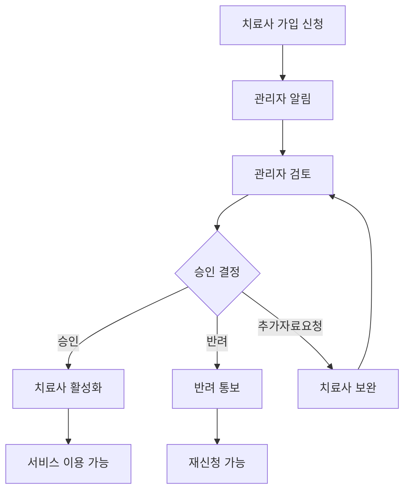
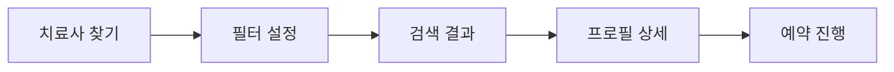
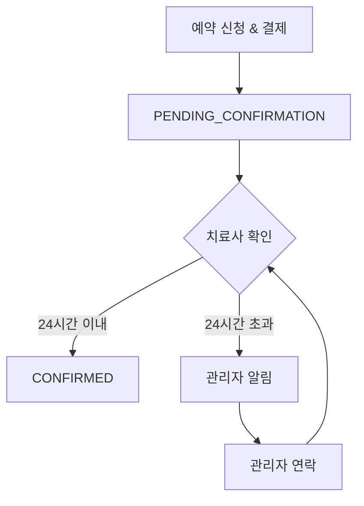
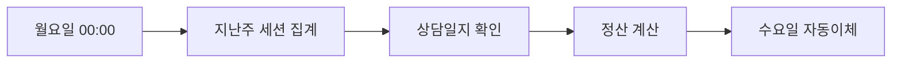

# 역할별 상세 프로세스 플로우

## 1. 치료사 온보딩 (회원가입 및 승인)

### 1.1 치료사 회원가입 프로세스

#### Step 1: 기본 정보 입력
```
┌─────────────────────────────────────┐
│ 치료사 회원가입 (1/3)               │
├─────────────────────────────────────┤
│ 기본 정보                           │
│                                     │
│ 이름: [_________]                   │
│ 성별: ○ 남성  ● 여성  ○ 기타       │
│ 생년: [1990]년                      │
│ 전화번호: [010-____-____]           │
│ 이메일: [_________@___.___ ]        │
│ 주소: [서울시 강남구 ...]           │
│ 상세주소: [_________]               │
│                                     │
│ [다음 단계]                         │
└─────────────────────────────────────┘
```

#### Step 2: 전문 정보 입력
```
┌─────────────────────────────────────┐
│ 치료사 회원가입 (2/3)               │
├─────────────────────────────────────┤
│ 전문 정보                           │
│                                     │
│ 치료 분야: (중복 선택 가능)         │
│ ☑ 언어치료  ☑ 감각통합             │
│ ☐ 놀이치료  ☐ 미술치료             │
│ ☐ 음악치료  ☐ 작업치료             │
│ ☐ 인지치료  ☐ 행동치료             │
│                                     │
│ 치료 가능 아이 나이: (중복 가능)    │
│ ☑ 0-12개월   ☑ 13-24개월           │
│ ☑ 25-36개월  ☐ 37-48개월           │
│ ☐ 49-60개월  ☐ 5-7세  ☐ 8세 이상  │
│                                     │
│ 치료 가능 지역: (서울특별시)        │
│ ☑ 강남구  ☑ 서초구  ☐ 송파구      │
│ ☐ 강동구  ☑ 광진구  ☐ 성동구      │
│                                     │
│ 세션 비용: [80,000]원 (50분 기준)   │
│                                     │
│ [이전] [다음 단계]                  │
└─────────────────────────────────────┘
```

#### Step 3: 자격증 및 경력
```
┌─────────────────────────────────────┐
│ 치료사 회원가입 (3/3)               │
├─────────────────────────────────────┤
│ 자격증                              │
│ 자격증명: [언어치료사 1급]          │
│ 발급기관: [한국언어치료사협회]      │
│ 취득일: [2018-03-15]                │
│ 자격증 사본: certificate1.pdf ✅    │
│ [+ 자격증 추가]                     │
│                                     │
│ 경력                                │
│ 근무형태: ● 기관  ○ 프리랜서        │
│ 기관명: [OO발달센터]                │
│ 치료분야: [언어치료]                │
│ 재직기간: 2018-04 ~ 2022-12         │
│ [+ 경력 추가]                       │
│                                     │
│ [이전] [가입 신청]                  │
└─────────────────────────────────────┘
```

### 1.2 관리자 승인 프로세스



### 1.3 초기 설정 체크리스트

승인 후 치료사가 완료해야 할 작업:
- [ ] 프로필 사진 등록
- [ ] 자기소개 작성
- [ ] 스케줄 설정 (3개월분)
- [ ] 정산 계좌 등록

## 2. 치료사 스케줄 관리

### 2.1 일괄 생성

```
┌─────────────────────────────────────┐
│ 스케줄 일괄 생성                    │
├─────────────────────────────────────┤
│ 생성 기간:                          │
│ 시작: [2025-10-15]                  │
│ 종료: [2025-12-31] (최대 3개월)     │
│                                     │
│ 요일별 시간 설정:                   │
│ ☑ 월: 09:00-12:00, 14:00-18:00     │
│ ☑ 화: 09:00-12:00, 14:00-18:00     │
│ ☐ 수: (휴무)                        │
│ ☑ 목: 09:00-12:00, 14:00-18:00     │
│ ☑ 금: 09:00-12:00, 14:00-18:00     │
│ ☑ 토: 10:00-14:00                   │
│ ☐ 일: (휴무)                        │
│                                     │
│ 세션 설정:                          │
│ - 세션 시간: ● 50분 ○ 80분         │
│ - 동시 예약 수: [2] 명              │
│                                     │
│ [생성하기]                          │
└─────────────────────────────────────┘
```

**특징:**
- 최대 3개월 일괄 생성
- 요일별 패턴 설정
- 동시 예약 가능 인원 설정
- 휴일 자동 제외

### 2.2 휴일 관리

```
┌─────────────────────────────────────┐
│ 휴일 관리                           │
├─────────────────────────────────────┤
│ 개인 휴일:                          │
│ • 2025-10-25 (개인 사유)            │
│ • 2025-11-15~17 (가족 여행)         │
│                                     │
│ [새 휴일 추가]                      │
│ 유형: ● 단일 날짜 ○ 기간            │
│ 날짜: [2025-12-31]                  │
│ 사유: [연말 휴무]                   │
│                                     │
│ ☑ 국가 공휴일 자동 적용             │
└─────────────────────────────────────┘
```

## 3. 부모 예약 플로우

### 3.1 치료사 검색



**필터 옵션:**
- 지역 (구 단위)
- 치료 분야
- 경력
- 세션 비용
- 리뷰 평점

### 3.2 예약 및 결제

```
┌─────────────────────────────────────┐
│ 예약 신청                           │
├─────────────────────────────────────┤
│ 아이: OO이 (24개월, 남아)           │
│                                     │
│ 세션 타입:                          │
│ ○ 방문 컨설팅 (1회)                 │
│ ● 치료 (정기 세션)                  │
│                                     │
│ 세션 회수:                          │
│ ○ 1회: ₩80,000                     │
│ ○ 4회: ₩304,000 (5% 할인)          │
│ ● 8회: ₩576,000 (10% 할인)         │
│ ○ 12회: ₩816,000 (15% 할인)        │
│                                     │
│ 방문 주소: [서울시 강남구...]        │
│                                     │
│ [결제하기]                          │
└─────────────────────────────────────┘
```

**예약 프로세스:**
1. 날짜/시간 선택 (다음달까지만)
2. 세션 정보 입력
3. 결제 진행
4. **즉시 예약 확정** (치료사 승인 불필요)

### 3.3 예약 제한 사항

- **예약 가능 기간**: 오늘 ~ 다음달 말
- **버퍼 타임**: 세션 후 1시간 자동 차단
- **방문 컨설팅**: 1회만 예약 가능
- **치료**: 1, 4, 8, 12회 패키지

## 4. 예약 확인 프로세스

### 4.1 치료사 확인 (24시간)



### 4.2 알림 시스템

**치료사 알림:**
- 새 예약 요청 (즉시)
- 확인 리마인더 (12시간 후)
- 최종 경고 (20시간 후)

**부모 알림:**
- 예약 확인됨
- 예약 거절됨 (사유 포함)
- 세션 리마인더 (D-1, 2시간 전)

## 5. 세션 진행 및 완료

### 5.1 세션 당일 프로세스

```
D-1: 리마인더 알림
↓
D-Day 2시간 전: 최종 알림
↓
세션 시작
↓
세션 진행 (50분)
↓
상담일지 작성 (치료사)
↓
피드백 요청 (부모)
```

### 5.2 상담일지 작성

**필수 항목:**
- 세션 날짜/시간
- 활동 내용
- 아이 반응
- 다음 세션 계획
- 부모 안내사항

**작성 기한:** 세션 후 48시간 이내

## 6. 정산 프로세스

### 6.1 자동 정산 사이클



### 6.2 정산 계산

```
완료 세션: 6건
상담일지 작성: 5건
정산 대상: 5건

세션 비용: ₩400,000
플랫폼 수수료 (15%): -₩60,000
원천징수 (3.3%): -₩11,220
실지급액: ₩328,780
```

**정산 조건:**
- 세션 완료됨
- 상담일지 작성 완료
- 클레임 없음

## 7. 관리자 모니터링

### 7.1 대시보드 주요 지표

- 일일 예약 현황
- 미확인 예약 (24시간 경과)
- 클레임 접수 현황
- 정산 대기 건수
- 치료사 승인 대기

### 7.2 개입이 필요한 상황

- [ ] 치료사 24시간 미확인
- [ ] 반복적인 취소/노쇼
- [ ] 클레임 발생
- [ ] 정산 이슈
- [ ] 시스템 오류

## 8. 예외 상황 처리

### 8.1 예약 취소

**부모 취소:**
- D-3 이전: 전액 환불
- D-2~D-1: 50% 환불
- 당일: 환불 불가

**치료사 취소:**
- 전액 환불
- 대체 치료사 제안
- 보상 쿠폰 발급

### 8.2 노쇼 처리

**부모 노쇼:**
- 환불 불가
- 3회 누적 시 이용 제한

**치료사 노쇼:**
- 전액 환불 + 보상
- 경고 조치
- 반복 시 계약 해지