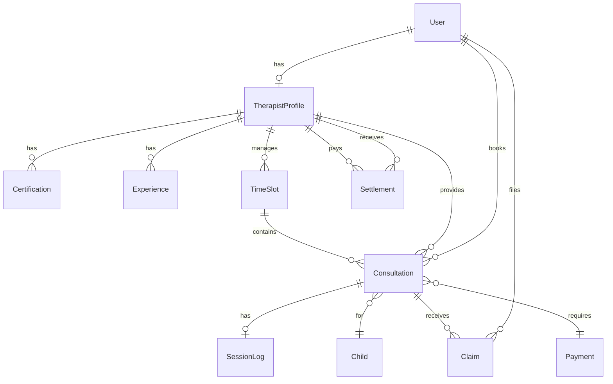

# 데이터 모델 정의

## 1. 주요 엔티티

### User (사용자)
```prisma
model User {
  id        String   @id @default(cuid())
  email     String   @unique
  name      String?
  password  String?
  phone     String?
  role      Role     @default(PARENT)
  avatar    String?
  createdAt DateTime @default(now())
  updatedAt DateTime @updatedAt

  // Relations
  therapistProfile TherapistProfile?
  consultations    Consultation[]
  claims           Claim[]
}

enum Role {
  PARENT
  THERAPIST
  ADMIN
}
```

### TherapistProfile (치료사 프로필)
```prisma
model TherapistProfile {
  id              String   @id @default(cuid())
  userId          String   @unique

  // 기본 정보
  gender          Gender?
  birthYear       Int?
  address         String?
  addressDetail   String?

  // 전문 정보
  specialties     String   // JSON: ["SPEECH_THERAPY", "SENSORY_INTEGRATION"]
  childAgeRanges  String   // JSON: ["AGE_0_12", "AGE_13_24"]
  serviceAreas    String   // JSON: ["GANGNAM", "SEOCHO"]
  sessionFee      Int?     // 50분 기준

  // 승인 관련
  approvalStatus  ApprovalStatus @default(PENDING)
  approvedAt      DateTime?
  approvedBy      String?
  rejectedAt      DateTime?
  rejectionReason String?

  // Relations
  user            User @relation(fields: [userId], references: [id])
  certifications  Certification[]
  experiences     Experience[]
  timeSlots       TimeSlot[]
  consultations   Consultation[]
  settlements     Settlement[]
}

enum ApprovalStatus {
  PENDING
  PENDING_ADDITIONAL_INFO
  APPROVED
  REJECTED
}
```

### Certification (자격증)
```prisma
model Certification {
  id                  String   @id @default(cuid())
  therapistProfileId  String
  name                String   // 자격증명
  issuingOrganization String   // 발급기관
  issueDate           DateTime // 취득일
  filePath            String?  // 자격증 사본

  therapistProfile TherapistProfile @relation(fields: [therapistProfileId], references: [id])
}
```

### Experience (경력)
```prisma
model Experience {
  id                 String         @id @default(cuid())
  therapistProfileId String
  employmentType     EmploymentType // 기관/프리랜서
  institutionName    String?        // 기관명
  specialty          TherapyType    // 치료분야
  startDate          DateTime
  endDate            DateTime?      // null이면 재직중
  description        String?

  therapistProfile TherapistProfile @relation(fields: [therapistProfileId], references: [id])
}

enum EmploymentType {
  INSTITUTION
  FREELANCER
}

enum TherapyType {
  SPEECH_THERAPY
  SENSORY_INTEGRATION
  PLAY_THERAPY
  ART_THERAPY
  MUSIC_THERAPY
  OCCUPATIONAL_THERAPY
  COGNITIVE_THERAPY
  BEHAVIORAL_THERAPY
}
```

### TimeSlot (예약 가능 시간)
```prisma
model TimeSlot {
  id               String   @id @default(cuid())
  therapistId      String
  date             DateTime
  startTime        String   // "09:00"
  endTime          String   // "09:50"

  // 상태
  isAvailable      Boolean  @default(true)
  isHoliday        Boolean  @default(false)
  isBufferBlocked  Boolean  @default(false)
  blockedBy        String?  // 버퍼로 막은 예약 ID

  // 예약 관리
  maxCapacity      Int      @default(1)
  currentBookings  Int      @default(0)

  createdAt        DateTime @default(now())
  updatedAt        DateTime @updatedAt

  // Relations
  therapist     TherapistProfile @relation(fields: [therapistId], references: [id])
  consultations Consultation[]

  @@index([therapistId, date, isAvailable])
  @@unique([therapistId, date, startTime])
}
```

### Consultation (상담/치료 세션)
```prisma
model Consultation {
  id           String   @id @default(cuid())
  timeSlotId   String
  parentUserId String
  childId      String
  therapistId  String

  // 세션 정보
  scheduledAt  DateTime
  duration     Int      @default(50)
  sessionType  SessionType @default(THERAPY)
  sessionCount Int      @default(1)

  // 상태
  status       ConsultationStatus @default(PENDING_CONFIRMATION)

  // 확인 관련
  confirmationDeadline DateTime?
  confirmedAt          DateTime?
  confirmedBy          String?

  // 결제
  fee          Int
  paymentId    String?

  // 세션 내용
  notes        String?
  feedback     String?

  createdAt    DateTime @default(now())
  updatedAt    DateTime @updatedAt

  // Relations
  timeSlot     TimeSlot @relation(fields: [timeSlotId], references: [id])
  parentUser   User @relation(fields: [parentUserId], references: [id])
  child        Child @relation(fields: [childId], references: [id])
  therapist    TherapistProfile @relation(fields: [therapistId], references: [id])
  sessionLog   SessionLog?
  claims       Claim[]

  @@index([therapistId, scheduledAt, status])
  @@index([parentUserId, status])
  @@index([status, confirmationDeadline])
}

enum SessionType {
  CONSULTATION  // 방문 컨설팅 (1회)
  THERAPY       // 치료 (1,4,8,12회)
}

enum ConsultationStatus {
  PENDING_CONFIRMATION  // 치료사 확인 대기
  CONFIRMED            // 확정
  IN_PROGRESS          // 진행중
  COMPLETED            // 완료
  CANCELLED            // 취소
  NO_SHOW              // 노쇼
}
```

### SessionLog (상담일지)
```prisma
model SessionLog {
  id             String   @id @default(cuid())
  consultationId String   @unique

  // 세션 기록
  actualStart    DateTime?
  actualEnd      DateTime?
  location       String?

  // 내용
  activities     String   // 활동 내용
  childResponse  String   // 아이 반응
  parentGuide    String   // 부모 안내
  nextPlan       String?  // 다음 계획

  // 첨부
  attachments    String?  // JSON: 파일 경로들

  createdAt      DateTime @default(now())
  updatedAt      DateTime @updatedAt

  consultation Consultation @relation(fields: [consultationId], references: [id])

  @@index([createdAt])
}
```

### Payment (결제)
```prisma
model Payment {
  id            String   @id @default(cuid())
  consultationId String?
  userId        String

  // 결제 정보
  amount        Int
  method        PaymentMethod
  status        PaymentStatus

  // PG 정보
  pgProvider    String?  // "toss", "kakao", etc
  pgTid         String?  // PG사 거래 ID

  // 환불
  refundAmount  Int?
  refundReason  String?
  refundedAt    DateTime?

  createdAt     DateTime @default(now())
  updatedAt     DateTime @updatedAt

  @@index([userId, status])
  @@index([consultationId])
}

enum PaymentMethod {
  CARD
  BANK_TRANSFER
  EASY_PAY
}

enum PaymentStatus {
  PENDING
  COMPLETED
  FAILED
  REFUNDED
  PARTIAL_REFUNDED
}
```

### Claim (클레임)
```prisma
model Claim {
  id              String   @id @default(cuid())
  consultationId  String
  claimantId      String   // 신청자
  claimantType    ClaimantType
  respondentId    String   // 피신청자

  // 클레임 내용
  claimType       ClaimType
  title           String
  description     String
  evidence        String?
  requestedAction String

  // 시스템 수집 증거
  gpsData         String?
  sessionStarted  Boolean  @default(false)
  contactAttempts Int      @default(0)

  // 응답
  respondentReply    String?
  respondentEvidence String?
  respondentRepliedAt DateTime?

  // 관리자 처리
  adminId         String?
  adminNotes      String?
  decision        ClaimDecision?
  decisionReason  String?
  decidedAt       DateTime?

  // 보상/패널티
  refundAmount    Int?
  compensation    String?
  penalties       String?

  status          ClaimStatus @default(PENDING)
  createdAt       DateTime @default(now())
  updatedAt       DateTime @updatedAt

  // Relations
  consultation Consultation @relation(fields: [consultationId], references: [id])
  claimant     User @relation(fields: [claimantId], references: [id])

  @@index([consultationId])
  @@index([claimantId, status])
  @@index([status, createdAt])
}

enum ClaimantType {
  PARENT
  THERAPIST
}

enum ClaimType {
  NO_SHOW
  SERVICE_QUALITY
  TIME_ISSUE
  PAYMENT_ISSUE
  OTHER
}

enum ClaimStatus {
  PENDING
  IN_REVIEW
  RESOLVED
  REJECTED
  WITHDRAWN
}

enum ClaimDecision {
  FULL_REFUND
  PARTIAL_REFUND
  NO_REFUND
  COMPENSATION
  WARNING
  NO_ACTION
}
```

### Settlement (정산)
```prisma
model Settlement {
  id           String   @id @default(cuid())
  therapistId  String

  // 정산 기간
  startDate    DateTime
  endDate      DateTime

  // 세션 정보
  sessionCount Int
  totalAmount  Int

  // 공제
  platformFee  Int      // 플랫폼 수수료
  tax          Int      // 원천징수
  deductions   Int?     // 기타 공제

  // 지급
  netAmount    Int      // 실지급액
  paidAt       DateTime?

  status       SettlementStatus @default(PENDING)

  createdAt    DateTime @default(now())
  updatedAt    DateTime @updatedAt

  therapist TherapistProfile @relation(fields: [therapistId], references: [id])

  @@index([therapistId, status])
  @@index([startDate, endDate])
}

enum SettlementStatus {
  PENDING
  APPROVED
  PAID
  HELD
  CANCELLED
}
```

### HolidayDate (휴일 관리)
```prisma
model HolidayDate {
  id          String   @id @default(cuid())
  therapistId String?  // null이면 공휴일
  date        DateTime
  reason      String?
  isRecurring Boolean  @default(false)

  createdAt   DateTime @default(now())

  @@unique([therapistId, date])
  @@index([date])
}
```

## 2. 관계 다이어그램



## 3. 인덱스 전략

### 자주 조회되는 패턴

1. **치료사 검색**
   - `TherapistProfile`: specialties, serviceAreas, approvalStatus
   - `TimeSlot`: therapistId + date + isAvailable

2. **예약 조회**
   - `Consultation`: parentUserId + status
   - `Consultation`: therapistId + scheduledAt + status
   - `Consultation`: status + confirmationDeadline

3. **정산 처리**
   - `SessionLog`: createdAt (range query)
   - `Settlement`: therapistId + status
   - `Settlement`: startDate + endDate

4. **클레임 관리**
   - `Claim`: claimantId + status
   - `Claim`: status + createdAt

## 4. 데이터 제약사항

### TimeSlot
- `maxCapacity`: 1-5 사이
- `startTime`, `endTime`: HH:MM 형식
- 같은 치료사, 날짜, 시간은 중복 불가

### Consultation
- `sessionCount`: 1, 4, 8, 12만 가능
- `duration`: 50 또는 80분
- CONSULTATION 타입은 sessionCount = 1만 가능

### Payment
- `amount`: 양수
- `refundAmount`: amount 이하

### Settlement
- `platformFee`: 총액의 15%
- `tax`: 총액의 3.3%
- `netAmount` = totalAmount - platformFee - tax - deductions

## 5. 트리거 및 자동화

### 예약 확정 시
1. TimeSlot의 currentBookings 증가
2. 버퍼 타임 자동 차단 (다음 1시간)
3. confirmationDeadline 설정 (24시간)

### 세션 완료 시
1. ConsultationStatus → COMPLETED
2. 정산 대기 큐에 추가

### 정산 실행 시 (매주 월요일)
1. 지난주 COMPLETED 세션 집계
2. SessionLog 작성 여부 확인
3. Settlement 레코드 생성
4. 수요일 자동 이체 스케줄링