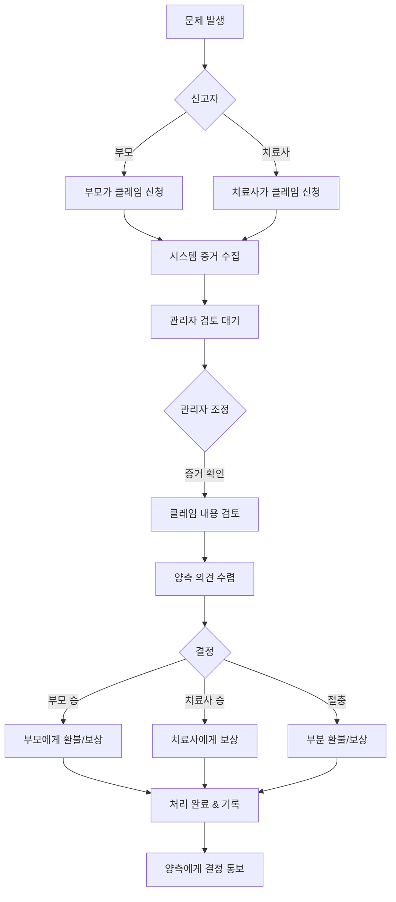

# 예외 처리 및 알림 시스템

## 1. 예외 처리 플로우

### 1.1 결제 실패 처리

```
부모 예약 신청 (T+0)
  ↓
세션 정보 입력 완료
  ↓
[결제하기] 클릭
  ↓
결제 시도 (T+0)
  ↓
결제 실패 (카드 한도 초과, 잔액 부족, 카드 오류 등)
  ↓
실패 사유 표시:
  ┌─────────────────────────────────────┐
  │ 결제 실패                           │
  ├─────────────────────────────────────┤
  │ ❌ 결제가 실패했습니다              │
  │                                     │
  │ 사유: 카드 한도 초과                │
  │                                     │
  │ [다른 카드로 재시도]                │
  │ [나중에 다시 시도]                  │
  └─────────────────────────────────────┘
```

**재시도 프로세스:**
```
1차 실패:
  - 예약 정보 임시 저장 (5분)
  - 다른 결제 수단 선택 가능
  - 해당 시간 오픈 상태 유지
  ↓
다른 카드로 재시도
  ↓
성공 → 예약 확정
실패 → 2-3차 재시도 가능
  ↓
시간 초과 (5분) 또는 [취소] 선택:
  - 임시 저장 정보 삭제
  - 해당 시간 다른 사람 예약 가능
  - 부모는 처음부터 다시 시도
```

**시스템 모니터링:**
```
결제 실패 다발 패턴 감지:
  - 특정 결제 게이트웨이 오류 증가
  - 특정 카드사 문제
  - 시스템 장애 가능성
  ↓
관리자 대시보드 알림
  ↓
관리자 확인 및 조치:
  - PG사 연락
  - 시스템 점검
  - 공지사항 발행
```

### 1.2 동시 예약 경합 처리 (Race Condition)

```
시나리오:
  15:50:00.000 - 부모A: 10월 5일 14:00 결제 시작
  15:50:00.100 - 부모B: 10월 5일 14:00 결제 시작
  (두 부모가 거의 동시에 같은 시간 예약 시도)
  ↓
시스템 처리 (트랜잭션 격리):
  1. 부모A 결제 완료 (15:50:02.000)
     - Consultation 생성 (CONFIRMED)
     - 해당 시간 슬롯 DB 잠금
     - 부모A에게 확정 알림

  2. 부모B 결제 완료 시도 (15:50:02.500)
     - 트랜잭션 충돌 감지
     - "이미 예약된 시간입니다" 에러
     - 자동 환불 처리
     - 부모B에게 안내
  ┌─────────────────────────────────────┐
  │ 예약 불가                           │
  ├─────────────────────────────────────┤
  │ 죄송합니다.                         │
  │ 선택하신 시간은 방금 다른 분이      │
  │ 예약하셨습니다.                     │
  │                                     │
  │ 결제 금액은 자동 환불됩니다.        │
  │ (영업일 기준 3-5일 소요)            │
  │                                     │
  │ [다른 시간 선택하기]                │
  └─────────────────────────────────────┘
```

**낙관적 잠금 (Optimistic Locking):**
```typescript
// 예약 생성 시 동시성 제어
async function createConsultation(data) {
  return await prisma.$transaction(async (tx) => {
    // 1. 예약 가능 여부 재확인 (트랜잭션 내)
    const existing = await tx.consultation.findFirst({
      where: {
        therapistId: data.therapistId,
        scheduledDate: data.scheduledDate,
        status: { in: ['CONFIRMED', 'COMPLETED'] }
      },
      lock: true // 비관적 잠금
    })

    if (existing) {
      throw new ConflictError('이미 예약된 시간입니다')
    }

    // 2. 예약 생성
    const consultation = await tx.consultation.create({
      data: {
        ...data,
        status: 'CONFIRMED'
      }
    })

    // 3. 결제 처리
    const payment = await tx.payment.create({
      data: {
        consultationId: consultation.id,
        amount: data.amount,
        status: 'COMPLETED'
      }
    })

    return { consultation, payment }
  }, {
    isolationLevel: 'Serializable' // 최고 격리 수준
  })
}
```

**데이터베이스 제약 조건:**
```sql
-- Unique constraint로 동시 예약 방지
CREATE UNIQUE INDEX unique_therapist_schedule
ON consultations(therapist_id, scheduled_date, scheduled_time)
WHERE status IN ('CONFIRMED', 'COMPLETED');
```

## 2. 클레임 시스템 (통합 처리)

클레임 시스템은 노쇼, 서비스 품질, 결제 문제 등 모든 분쟁을 통합 관리합니다.

### 2.1 클레임 프로세스 개요



### 2.2 클레임 신청 (부모/치료사)

**케이스 A: 치료사 노쇼**
```
세션 시작 시간 (14:00)
  ↓
15분 경과 (14:15)
  ↓
부모 앱에서 [클레임 신청] 버튼 활성화
  ↓
부모가 클레임 신청
  ┌─────────────────────────────────────┐
  │ 클레임 신청                         │
  ├─────────────────────────────────────┤
  │ 문제 유형:                          │
  │ ● 치료사 미도착 (노쇼)              │
  │ ○ 서비스 품질 문제                  │
  │ ○ 일정 관련 문제                    │
  │ ○ 기타                              │
  │                                     │
  │ 상세 설명:                          │
  │ [치료사가 약속 시간에 오지 않음]    │
  │                                     │
  │ 증거 첨부: (선택)                   │
  │ [사진/영상 업로드]                  │
  │                                     │
  │ 요청사항:                           │
  │ ☑ 전액 환불                         │
  │ ☑ 무료 재예약                       │
  │                                     │
  │ [클레임 제출]                       │
  └─────────────────────────────────────┘
  ↓
시스템 자동 처리:
  1. Claim 레코드 생성 (status: PENDING)
  2. 증거 자동 수집:
     - 치료사 GPS 위치 기록
     - 세션 시작 시도 여부
     - 통화 기록 (있는 경우)
  3. 치료사에게 긴급 알림
     - "부모님이 노쇼 클레임을 제출했습니다"
     - "24시간 이내 의견 제출 필요"
  4. 관리자 대시보드에 등록
  5. 부모에게 확인
     - "클레임이 접수되었습니다"
     - "관리자 검토 후 처리됩니다"
```

**케이스 B: 부모 노쇼**
```
세션 시작 시간 (14:00)
  ↓
10분 경과 (14:10)
  ↓
치료사 앱에서 [클레임 신청] 버튼 활성화
  ↓
치료사가 클레임 신청
  ┌─────────────────────────────────────┐
  │ 클레임 신청                         │
  ├─────────────────────────────────────┤
  │ 문제 유형:                          │
  │ ● 부모 부재 (노쇼)                  │
  │ ○ 결제 문제                         │
  │ ○ 일정 관련 문제                    │
  │ ○ 기타                              │
  │                                     │
  │ 상세 설명:                          │
  │ [방문했으나 부모님 부재]            │
  │                                     │
  │ 증거 첨부: (필수)                   │
  │ [현장 사진 업로드]                  │
  │ GPS 위치 자동 첨부 ✅               │
  │                                     │
  │ 요청사항:                           │
  │ ☑ 세션 비용 전액 지급               │
  │                                     │
  │ [클레임 제출]                       │
  └─────────────────────────────────────┘
  ↓
시스템 자동 처리:
  1. Claim 레코드 생성 (status: PENDING)
  2. 증거 자동 수집:
     - 치료사 GPS 위치 (방문 증명)
     - 현장 사진
     - 부모 통화 시도 기록
  3. 부모에게 알림
     - "치료사가 노쇼 클레임을 제출했습니다"
     - "24시간 이내 의견 제출 필요"
  4. 관리자 대시보드에 등록
  5. 치료사에게 확인
     - "클레임이 접수되었습니다"
     - "관리자 검토 후 처리됩니다"
```

**케이스 C: 서비스 품질 문제**
```
세션 완료 후 (언제든지)
  ↓
부모가 클레임 신청
  ┌─────────────────────────────────────┐
  │ 클레임 신청                         │
  ├─────────────────────────────────────┤
  │ 문제 유형:                          │
  │ ○ 치료사 미도착 (노쇼)              │
  │ ● 서비스 품질 문제                  │
  │ ○ 일정 관련 문제                    │
  │ ○ 기타                              │
  │                                     │
  │ 구체적 문제:                        │
  │ ☑ 약속 시간보다 짧은 세션           │
  │ ☐ 비전문적 태도                     │
  │ ☐ 약속한 서비스 미제공              │
  │ ☐ 기타                              │
  │                                     │
  │ 상세 설명:                          │
  │ [50분 약속이었으나 30분만 진행]     │
  │                                     │
  │ 요청사항:                           │
  │ ☑ 부분 환불                         │
  │                                     │
  │ [클레임 제출]                       │
  └─────────────────────────────────────┘
```

### 2.3 관리자 클레임 조정 프로세스

```
관리자 대시보드
  ┌─────────────────────────────────────┐
  │ 🚨 신규 클레임 (3건)                │
  ├─────────────────────────────────────┤
  │ 클레임 #1234                        │
  │ 유형: 치료사 노쇼                   │
  │ 신청자: 이OO 부모                   │
  │ 대상: 김XX 치료사                   │
  │ 세션: 10월 5일 14:00               │
  │ 신청일시: 10월 5일 14:20           │
  │ 상태: 검토 대기                     │
  │                                     │
  │ [상세보기] [즉시 처리]              │
  └─────────────────────────────────────┘
  ↓
[상세보기] 클릭
  ↓
클레임 상세 화면
  ┌─────────────────────────────────────┐
  │ 클레임 #1234 - 상세                │
  ├─────────────────────────────────────┤
  │ 기본 정보:                          │
  │ - 유형: 치료사 노쇼                 │
  │ - 세션: 10월 5일 14:00-14:50       │
  │ - 금액: ₩80,000                    │
  │                                     │
  │ 신청자 (부모) 주장:                 │
  │ "치료사가 약속 시간에 오지 않음"    │
  │                                     │
  │ 수집된 증거:                        │
  │ ✅ 치료사 GPS: 다른 위치 (5km 떨어짐)│
  │ ✅ 세션 시작 시도: 없음             │
  │ ⚠️  치료사 연락 시도: 없음           │
  │                                     │
  │ 대상자 (치료사) 의견:               │
  │ "교통사고로 늦어졌습니다"           │
  │ [사고 현장 사진 첨부]               │
  │                                     │
  │ 관리자 메모:                        │
  │ [교통사고 증거 확인됨, 그러나...    │
  │  사전 연락 없음]                    │
  │                                     │
  │ 조정 결정:                          │
  │ ● 부모 전액 환불 + 무료 쿠폰       │
  │ ○ 부모 전액 환불만                  │
  │ ○ 부모 부분 환불 (50%)              │
  │ ○ 클레임 거절                       │
  │                                     │
  │ 치료사 처리:                        │
  │ ☑ 경고 1회                          │
  │ ☐ 정지 (7일)                        │
  │ ☐ 패널티 없음                       │
  │                                     │
  │ 결정 사유:                          │
  │ [교통사고는 인정되나 사전 연락...    │
  │  의무를 다하지 않았으므로...]       │
  │                                     │
  │ [결정 확정 & 처리]                  │
  └─────────────────────────────────────┘
  ↓
[결정 확정 & 처리] 클릭
  ↓
시스템 자동 처리:
  1. Claim 상태 → RESOLVED
  2. 결정 내용 기록
  3. 환불 처리 (필요시)
     - Payment 환불 트랜잭션 생성
     - 3-5 영업일 이내 환불
  4. 보상 처리 (필요시)
     - 무료 쿠폰 발급
     - 치료사 비용 지급
  5. 패널티 적용 (필요시)
     - 경고 누적
     - 평점 하락
     - 정지 처리
  6. 양측에게 결정 통보
     - 부모: "클레임이 승인되었습니다"
     - 치료사: "클레임 결과를 확인하세요"
  7. 상태 기록 및 통계 업데이트
```

### 2.4 클레임 결과 통보

**부모에게 (승인 시):**
```
  ┌─────────────────────────────────────┐
  │ 클레임 처리 완료                    │
  ├─────────────────────────────────────┤
  │ 클레임 #1234가 승인되었습니다       │
  │                                     │
  │ 결과:                               │
  │ ✅ 전액 환불 (₩80,000)              │
  │ ✅ 무료 세션 쿠폰 1장 지급          │
  │                                     │
  │ 환불 예정일: 10월 10일              │
  │                                     │
  │ 관리자 의견:                        │
  │ "교통사고로 인한 불가피한 상황...   │
  │  이나 사전 연락 의무를 다하지...    │
  │  않아 전액 환불 처리합니다."        │
  │                                     │
  │ 불편을 드려 죄송합니다.             │
  │ [확인]                              │
  └─────────────────────────────────────┘
```

**치료사에게 (패널티 있는 경우):**
```
  ┌─────────────────────────────────────┐
  │ ⚠️ 클레임 결과 통보                 │
  ├─────────────────────────────────────┤
  │ 클레임 #1234 처리 결과              │
  │                                     │
  │ 결정: 부모 승인                     │
  │                                     │
  │ 조치 사항:                          │
  │ - 경고 1회 부여                     │
  │ - 평점 0.2점 차감                   │
  │ - 해당 세션 비용 미지급             │
  │                                     │
  │ 관리자 의견:                        │
  │ "긴급 상황 발생 시 부모님께...      │
  │  사전 연락하는 것이 중요합니다."    │
  │                                     │
  │ 경고 누적: 1회 (3회 시 정지)        │
  │                                     │
  │ [확인] [이의 제기]                  │
  └─────────────────────────────────────┘
```

## 3. 취소 및 환불 처리

### 3.1 시점별 환불 정책

```typescript
function calculateRefund(
  sessionDate: Date,
  cancelDate: Date,
  amount: number
): RefundInfo {
  const hoursUntilSession =
    (sessionDate.getTime() - cancelDate.getTime()) / (1000 * 60 * 60)

  if (hoursUntilSession >= 48) {
    // 48시간 전: 전액 환불
    return {
      refundAmount: amount,
      refundRate: 100,
      therapistCompensation: 0
    }
  } else if (hoursUntilSession >= 24) {
    // 24-48시간 전: 50% 환불
    return {
      refundAmount: amount * 0.5,
      refundRate: 50,
      therapistCompensation: amount * 0.5
    }
  } else {
    // 24시간 이내: 환불 불가
    return {
      refundAmount: 0,
      refundRate: 0,
      therapistCompensation: amount
    }
  }
}
```

### 3.2 긴급 상황 처리

```
24시간 이내 취소 (긴급 상황)
  ↓
부모가 [긴급 상황] 선택
  ↓
증빙 자료 요청
  ┌─────────────────────────────────────┐
  │ 긴급 상황 확인                      │
  ├─────────────────────────────────────┤
  │ 취소 사유:                          │
  │ ● 아이 응급 상황                    │
  │ ○ 가족 응급 상황                    │
  │ ○ 천재지변                          │
  │                                     │
  │ 증빙 자료:                          │
  │ [사진 또는 문서 첨부]               │
  │                                     │
  │ [제출하기]                          │
  └─────────────────────────────────────┘
  ↓
관리자 검토
  ↓
승인 시:
  - 환불 정책 예외 적용
  - 전액 또는 부분 환불
  - 치료사에게도 일부 보상
  ↓
거절 시:
  - 일반 환불 정책 적용
```

## 4. 시스템 오류 처리

### 4.1 결제 실패
```
결제 시도
  ↓
외부 결제 시스템 오류
  ↓
시스템 처리:
  1. 에러 로그 기록
  2. 부모에게 안내
     "일시적인 오류가 발생했습니다"
     "다시 시도해주세요"
  3. 타이머 일시 정지
  4. 재시도 옵션 제공
  ↓
3회 재시도 실패
  ↓
대체 결제 수단 안내
  "다른 결제 수단을 선택해주세요"
```

### 4.2 알림 전송 실패
```
알림 발송 시도
  ↓
푸시 알림 실패
  ↓
대체 경로 시도:
  1. 이메일 발송
  2. SMS 발송 (중요 알림만)
  3. 앱 내 알림
  ↓
모든 경로 실패
  ↓
관리자 알림
  "알림 전송 실패: 사용자 XXX"
```

## 5. 알림 시스템

### 5.1 알림 종류

#### 즉시 알림 (Real-time)
| 이벤트 | 수신자 | 채널 | 내용 |
|--------|--------|------|------|
| 예약 신청 (결제 완료) | 부모 | 푸시, 이메일 | "예약 신청이 완료되었습니다. 치료사 확인 중입니다" |
| 예약 확인 요청 | 치료사 | 푸시, 이메일 | "새 예약을 확인해주세요 (24시간 이내)" |
| 예약 확인 12시간 경과 | 치료사 | 푸시, SMS | "아직 확인되지 않은 예약이 있습니다" |
| 예약 확인 완료 | 부모 | 푸시, 이메일 | "예약이 확정되었습니다!" |
| 예약 확인 완료 | 치료사 | 푸시 | "예약 확인이 완료되었습니다" |
| 예약 24시간 미확인 | 관리자 | 이메일, 대시보드 | "미확인 예약이 있습니다" |
| 결제 실패 | 부모 | 푸시 | "결제에 실패했습니다. 다시 시도해주세요" |
| 일정 변경 확정 | 치료사 | 푸시, 이메일 | "예약 일정이 변경되었습니다" |
| 일정 변경 확정 | 부모 | 푸시, 이메일 | "일정이 변경되었습니다" |
| 취소 요청 | 상대방 | 푸시, 이메일 | "예약이 취소되었습니다" |
| 상담일지 공유 | 부모 | 푸시, 앱 내 | "상담일지가 작성되었습니다" |

#### 스케줄 알림
| 이벤트 | 수신자 | 타이밍 | 내용 |
|--------|--------|--------|------|
| 세션 D-1 | 양측 | 전날 14:00 | "내일 OO이 세션이 예정되어 있습니다" |
| 세션 2시간 전 | 양측 | 2시간 전 | "곧 세션이 시작됩니다" |

#### 정산 알림
| 이벤트 | 수신자 | 타이밍 | 내용 |
|--------|--------|--------|------|
| 정산 확정 | 치료사 | 매주 월요일 | "이번 주 정산 금액이 확정되었습니다" |
| 입금 완료 | 치료사 | 매주 수요일 | "정산 금액이 입금되었습니다" |
| 상담일지 미작성 | 치료사 | 정산 시 | "상담일지 미작성으로 1건이 보류되었습니다" |

### 5.2 알림 우선순위

```
우선순위 1 (긴급):
- 클레임 신청 (양측에게 즉시)
- 클레임 결과 통보
- 긴급 취소
- 결제 실패
→ 푸시 + SMS + 이메일

우선순위 2 (중요):
- 예약 확인 요청 (치료사)
- 예약 확정
- 일정 변경 확정
- 예약 12시간 미확인 리마인드
→ 푸시 + 이메일

우선순위 3 (일반):
- 세션 리마인드
- 상담일지 공유
- 정산 확정
→ 푸시 + 앱 내 알림

우선순위 4 (정보):
- 새 리뷰 작성됨
- 추천 영상 업데이트
→ 앱 내 알림만
```

### 5.3 알림 설정

```
사용자 알림 설정 화면:
  ┌─────────────────────────────────────┐
  │ 알림 설정                           │
  ├─────────────────────────────────────┤
  │ 예약 관련:                          │
  │ ☑ 예약 확정 알림 (양측)             │
  │ ☑ 결제 실패 알림 (부모)             │
  │ ☑ 취소 알림                         │
  │                                     │
  │ 세션 관련:                          │
  │ ☑ 세션 D-1 리마인드                 │
  │ ☑ 세션 2시간 전 알림                │
  │ ☑ 상담일지 공유                     │
  │                                     │
  │ 정산 관련 (치료사만):               │
  │ ☑ 정산 확정 알림                    │
  │ ☑ 입금 완료 알림                    │
  │                                     │
  │ 알림 방식:                          │
  │ ☑ 푸시 알림                         │
  │ ☑ 이메일                            │
  │ ☐ SMS (긴급만)                      │
  │                                     │
  │ 방해 금지 시간:                     │
  │ 시작: 22:00                         │
  │ 종료: 08:00                         │
  │                                     │
  │ [저장하기]                          │
  └─────────────────────────────────────┘
```

## 6. 예외 처리 API

### 6.1 관리자용 미확인 예약 관리
```
GET /api/admin/consultations/unconfirmed
- 미확인 예약 목록 (24시간 초과)
- Query: ?sortBy=overdueDuration&page=1&limit=20
- Response: {
    unconfirmed: [...],
    total,
    page,
    totalPages
  }

POST /api/admin/consultations/[id]/manual-confirm
- 관리자 수동 확정
- Body: { adminNotes: "치료사 연락 후 수동 확정" }
- Response: { consultation: { status: "CONFIRMED" } }

POST /api/admin/consultations/[id]/force-cancel
- 관리자 강제 취소
- Body: { reason: "치료사 미응답으로 자동 취소" }
- Response: { refund: { amount, status } }
```

### 6.2 클레임 관리 API
```
GET /api/admin/claims
- 클레임 목록 조회
- Query: ?status=PENDING&claimType=NO_SHOW_THERAPIST

GET /api/admin/claims/[id]
- 클레임 상세 조회

POST /api/admin/claims/[id]/assign
- 클레임 담당자 배정

POST /api/admin/claims/[id]/resolve
- 클레임 조정 및 해결
- Body: {
    decision: "CLAIMANT_WIN",
    decisionReason: "증거 확인",
    refundAmount: 80000,
    compensation: { type: "COUPON", value: "FREE_SESSION_1" },
    penalties: { targetUserId, actions: [...] }
  }

GET /api/admin/claims/stats
- 클레임 통계
```