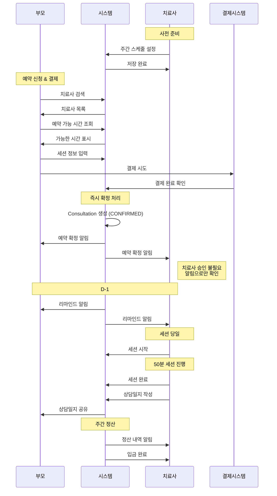
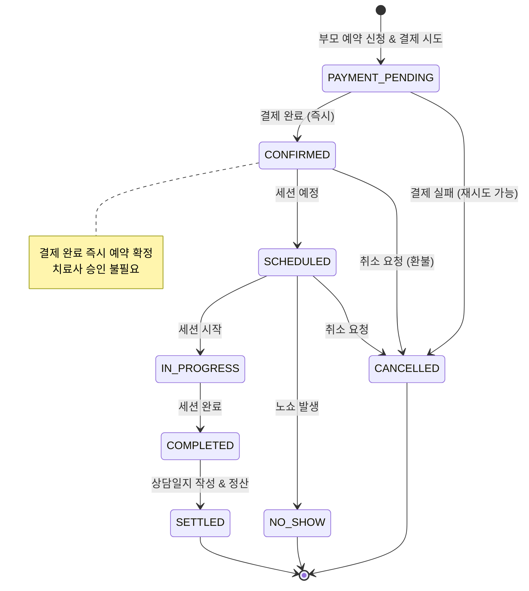
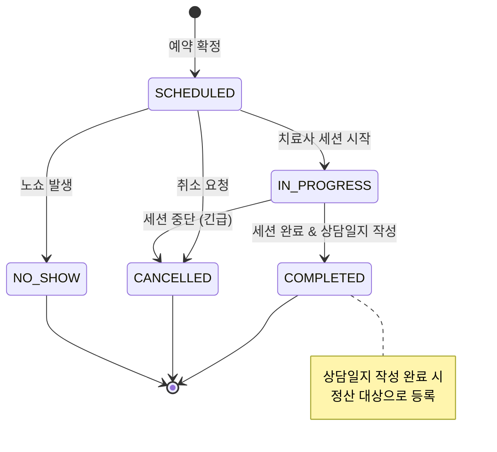
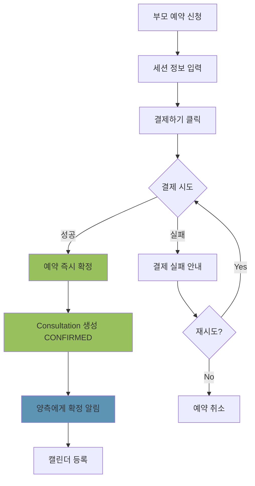
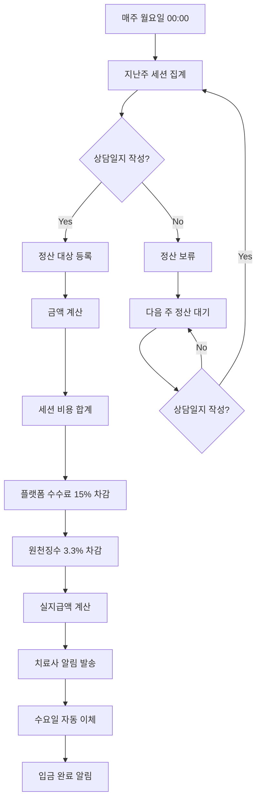

# 다이어그램 및 체크리스트

## 1. 다이어그램

### 1.1 전체 프로세스 시퀀스

### 1.2 매칭 상태 전이도

### 1.3 세션 상태 전이도

### 1.4 결제 및 예약 확정 플로우

### 1.5 정산 처리 플로우

## 2. 구현 체크리스트

### Phase 1: 스케줄 관리
- [ ] TimeSlot 모델 생성 (개별 슬롯 관리)
- [ ] HolidayDate 모델 생성 (휴일 관리)
- [ ] 타임 슬롯 일괄 생성 API
- [ ] 타임 슬롯 일괄 삭제 API
- [ ] 휴일 등록/삭제 API
- [ ] 국가 공휴일 API 연동
- [ ] 스케줄 일괄 생성 UI 구현
- [ ] 휴일 관리 UI 구현
- [ ] 캘린더 뷰 (슬롯 현황) 구현

### Phase 2: 예약 시스템
- [ ] SessionType enum 구현 (CONSULTATION, THERAPY)
- [ ] ConsultationStatus enum에 PENDING_CONFIRMATION 추가
- [ ] Consultation 모델 업데이트
  - [ ] sessionType, sessionCount 필드 추가
  - [ ] confirmationDeadline, confirmedAt, confirmedBy 필드 추가
  - [ ] 기본 status를 PENDING_CONFIRMATION으로 변경
- [ ] 세션 타입별 유효성 검증 로직
  - [ ] CONSULTATION: sessionCount === 1 검증
  - [ ] THERAPY: sessionCount ∈ [1, 4, 8, 12] 검증
- [ ] 예약 가능 슬롯 조회 로직 (currentBookings < maxCapacity && !isBufferBlocked)
- [ ] 예약 기간 제한 (오늘 ~ 다음 달 말일)
- [ ] 복수 예약 지원 (maxCapacity 체크)
- [ ] 버퍼 타임 자동 차단 로직
  - [ ] 예약 시 다음 1시간 슬롯 차단
  - [ ] 취소 시 버퍼 슬롯 해제
- [ ] 치료사 확인 프로세스
  - [ ] 예약 신청 시 confirmationDeadline 설정 (+ 24시간)
  - [ ] 치료사에게 확인 요청 알림 발송 (푸시, 이메일)
  - [ ] 치료사 예약 확인 API (POST /api/therapist/consultations/[id]/confirm)
  - [ ] 치료사 예약 거절 API (POST /api/therapist/consultations/[id]/reject)
  - [ ] 12시간 경과 시 리마인드 알림 발송
  - [ ] 24시간 미확인 시 관리자 대시보드 표시
- [ ] 관리자 미확인 예약 관리
  - [ ] 미확인 예약 목록 조회 API
  - [ ] 관리자 수동 확정 API
  - [ ] 관리자 강제 취소 API
  - [ ] 치료사별 확인율 통계 API
- [ ] 동시 예약 경합 처리 (트랜잭션 격리)
- [ ] 예약 신청 & 결제 통합 API
- [ ] TimeSlot.currentBookings 원자적 증감
- [ ] 결제 통합 (토스페이먼츠 / 아임포트)
- [ ] 결제 실패 재시도 로직

### Phase 3: 세션 관리
- [ ] SessionSeries 모델 생성
- [ ] Session 모델 생성
- [ ] SessionNote 모델 생성
- [ ] 세션 시작/완료 API
- [ ] 상담일지 작성 UI
- [ ] 상담일지 공유 기능

### Phase 4: 정산 시스템
- [ ] Settlement 모델 생성
- [ ] SettlementSession 모델 생성
- [ ] 주간 정산 배치 작업
- [ ] 정산 내역 조회 API
- [ ] 자동 이체 연동

### Phase 5: 알림 시스템
- [ ] 알림 모델 생성
- [ ] 푸시 알림 연동 (Firebase / OneSignal)
- [ ] 이메일 발송 연동 (SendGrid / Mailgun)
- [ ] SMS 발송 연동 (옵션)
- [ ] 치료사 확인 관련 알림
  - [ ] 예약 확인 요청 알림 (즉시)
  - [ ] 12시간 미확인 리마인드 알림
  - [ ] 24시간 미확인 관리자 알림
  - [ ] 예약 확정 알림 (양측)
- [ ] 알림 설정 UI

### Phase 6: 예외 처리
- [ ] 결제 실패 처리 및 재시도
- [ ] 동시 예약 경합 처리 (Race Condition)
- [ ] 취소/환불 정책 구현
- [ ] 일정 변경 즉시 확정 처리
  - [ ] 기존 예약 취소 + 새 예약 생성 원자적 처리
  - [ ] 버퍼 슬롯 해제 및 재차단
  - [ ] 취소 정책 자동 적용

### Phase 7: 클레임 시스템
- [ ] Claim 모델 생성 (노쇼, 서비스 품질, 결제 문제 등 통합)
- [ ] ClaimType, ClaimStatus, ClaimDecision enum 구현
- [ ] 클레임 신청 기능
  - [ ] 부모 클레임 신청 API
  - [ ] 치료사 클레임 신청 API
  - [ ] 시스템 자동 증거 수집 (GPS, 세션 시작 기록 등)
  - [ ] 상대방에게 자동 알림 발송
- [ ] 클레임 응답 기능
  - [ ] 피신청자 의견 제출 API
  - [ ] 증거 자료 첨부 기능
- [ ] 관리자 클레임 조정
  - [ ] 클레임 목록 조회 및 필터링
  - [ ] 클레임 상세 조회 (증거, 타임라인 포함)
  - [ ] 담당자 배정 기능
  - [ ] 클레임 해결 API
  - [ ] 자동 보상 처리 (환불, 쿠폰 발급)
  - [ ] 자동 패널티 적용 (경고, 평점 차감, 정지)
- [ ] 클레임 통계 및 리포팅
- [ ] 클레임 관련 알림
  - [ ] 클레임 신청 알림 (즉시, 양측)
  - [ ] 상대방 응답 알림
  - [ ] 클레임 결과 통보 알림
- [ ] 클레임 신청 UI (부모/치료사)
- [ ] 클레임 조정 UI (관리자 대시보드)

## 3. 테스트 체크리스트

### 3.1 단위 테스트
- [ ] 세션 타입 유효성 검증 로직
  - [ ] CONSULTATION + sessionCount=1 → 성공
  - [ ] CONSULTATION + sessionCount=4 → 실패 (400 에러)
  - [ ] THERAPY + sessionCount=8 → 성공
  - [ ] THERAPY + sessionCount=5 → 실패 (400 에러)
- [ ] 스케줄 가능 시간 계산 로직
- [ ] 버퍼 타임 차단/해제 로직
- [ ] 예약 기간 제한 검증 (다음 달까지만)
- [ ] 동시 예약 충돌 감지
- [ ] 복수 예약 가능 여부 판단
- [ ] 환불 금액 계산 로직
- [ ] 정산 금액 계산 로직
- [ ] 알림 발송 로직

### 3.2 통합 테스트
- [ ] 세션 타입별 예약 프로세스
  - [ ] 방문 컨설팅 (CONSULTATION) 1회 예약 성공
  - [ ] 방문 컨설팅 (CONSULTATION) 4회 예약 시도 → 실패
  - [ ] 치료 (THERAPY) 1/4/8/12회 예약 성공
  - [ ] UI에서 세션 타입 선택 시 회차 옵션 변경 확인
- [ ] 치료사 확인 프로세스
  - [ ] 예약 신청 후 PENDING_CONFIRMATION 상태 확인
  - [ ] confirmationDeadline 24시간 설정 확인
  - [ ] 치료사에게 확인 요청 알림 발송 확인
  - [ ] 치료사 확인 시 CONFIRMED 상태 변경 확인
  - [ ] 치료사 거절 시 환불 및 슬롯 해제 확인
  - [ ] 12시간 미확인 시 리마인드 알림 발송 확인
  - [ ] 24시간 미확인 시 관리자 대시보드 표시 확인
  - [ ] 관리자 수동 확정 처리 확인
  - [ ] 관리자 강제 취소 처리 확인
- [ ] 전체 예약 프로세스 (검색 → 결제 → 치료사 확인 → 확정)
- [ ] 버퍼 타임 자동 차단 검증
  - [ ] 14:00 예약 시 15:00 슬롯 차단 확인
  - [ ] 취소 시 버퍼 슬롯 해제 확인
- [ ] 예약 기간 제한 검증
  - [ ] 다음 달 이후 예약 시도 시 에러 확인
- [ ] 복수 예약 시나리오
  - [ ] maxCapacity = 2일 때 2명까지 예약 확인
- [ ] 일정 변경 프로세스 (즉시 확정)
  - [ ] 비어있는 슬롯으로 변경 성공
  - [ ] 기존 버퍼 슬롯 해제 및 새 버퍼 슬롯 차단 확인
  - [ ] 취소 정책에 따른 환불 금액 계산 확인
  - [ ] 원자적 트랜잭션 처리 (기존 취소 + 새 예약)
- [ ] 취소 및 환불 프로세스
- [ ] 세션 진행 및 정산 프로세스
- [ ] 클레임 시스템 통합 테스트
  - [ ] 치료사 노쇼 클레임 신청 (부모)
    - [ ] 클레임 생성 및 증거 자동 수집
    - [ ] 치료사에게 알림 발송
    - [ ] 관리자 대시보드 등록
  - [ ] 부모 노쇼 클레임 신청 (치료사)
    - [ ] GPS 위치 자동 첨부
    - [ ] 현장 사진 업로드
    - [ ] 부모에게 알림 발송
  - [ ] 피신청자 응답 프로세스
    - [ ] 의견 제출
    - [ ] 증거 자료 첨부
    - [ ] 신청자에게 알림
  - [ ] 관리자 클레임 조정
    - [ ] 클레임 목록 조회 및 필터링
    - [ ] 증거 자료 검토
    - [ ] 결정 및 보상/패널티 처리
    - [ ] 양측에게 결과 통보
  - [ ] 자동 처리 검증
    - [ ] 환불 트랜잭션 생성
    - [ ] 쿠폰 자동 발급
    - [ ] 경고 누적
    - [ ] 평점 차감
    - [ ] 정지 처리

### 3.3 부하 테스트
- [ ] 동시 예약 경합 처리 (Race Condition)
- [ ] 결제 동시 다발 처리
- [ ] 정산 배치 대량 데이터 처리
- [ ] 다수 클레임 동시 처리

## 4. 참고 문서

- [부모 사용자 플로우](./WORKFLOW_PARENT.md)
- [치료사 플로우](./WORKFLOW_THERAPIST.md)
- [관리자 플로우](./WORKFLOW_ADMIN.md)
- [시스템 연동 플로우](./WORKFLOW_SYSTEM.md)

## 5. 버전 이력

**작성일**: 2025-10-12
**최종 수정일**: 2025-10-14
**버전**: 1.5
**작성자**: AI Poten Development Team

### 주요 변경사항 (v1.5)
- **클레임 시스템 통합 구축**
  - 노쇼, 서비스 품질, 결제 문제 등 모든 분쟁을 통합 관리
  - 부모/치료사 클레임 신청 프로세스
  - 시스템 자동 증거 수집 (GPS, 세션 시작 기록, 통화 기록)
  - 양측 의견 수렴 프로세스
  - 관리자 조정 및 결정 시스템
  - 자동 보상 처리 (환불, 쿠폰 발급)
  - 자동 패널티 적용 (경고, 평점 차감, 계정 정지)
- **Claim 데이터 모델**:
  - Claim 모델 추가 (신청자, 피신청자, 증거, 결정 등)
  - ClaimType enum: 노쇼, 서비스 품질, 결제 문제 등
  - ClaimStatus enum: PENDING, IN_REVIEW, RESOLVED, REJECTED, CLOSED
  - ClaimDecision enum: 신청자 승, 피신청자 승, 절충, 양측 책임 없음
- **API 추가**:
  - 부모/치료사: 클레임 신청, 조회, 응답 API
  - 관리자: 클레임 조회, 담당자 배정, 상태 변경, 해결 API
  - 관리자: 클레임 통계 API

### 주요 변경사항 (v1.4)
- 치료사 예약 확인 프로세스 추가
  - 결제 완료 후 PENDING_CONFIRMATION 상태
  - 치료사 24시간 이내 확인 필수
  - 12시간 미확인 시 리마인드 알림
  - 24시간 미확인 시 관리자 대시보드 표시
  - 관리자 수동 확정/강제 취소 기능
- Consultation 모델 업데이트:
  - confirmationDeadline, confirmedAt, confirmedBy 필드 추가
  - ConsultationStatus enum에 PENDING_CONFIRMATION 추가
- API 추가:
  - 치료사: 예약 확인/거절 API
  - 관리자: 미확인 예약 조회, 수동 확정, 강제 취소 API
  - 관리자: 치료사별 확인율 통계 API

### 주요 변경사항 (v1.3)
- 일정 변경 프로세스 개선: 즉시 확정 방식으로 변경
  - 희망 일정 1순위, 2순위, 3순위 제거
  - 비어있는 슬롯에서 직접 선택
  - 치료사 승인 불필요 (즉시 확정)
  - 원자적 트랜잭션 처리 (기존 취소 + 새 예약)

### 주요 변경사항 (v1.2)
- 세션 타입 구분: 방문 컨설팅 (CONSULTATION) / 치료 (THERAPY)
  - 방문 컨설팅: 1회만 예약 가능
  - 치료: 1, 4, 8, 12회 선택 가능
- SessionType enum 추가 및 유효성 검증 로직 추가

### 주요 변경사항 (v1.1)
- 예약 기간 제한: 부모는 다음 달까지만 예약 가능
- 버퍼 타임 자동 차단: 세션 예약 시 다음 1시간 슬롯 자동 차단 (이동 및 휴식 시간)