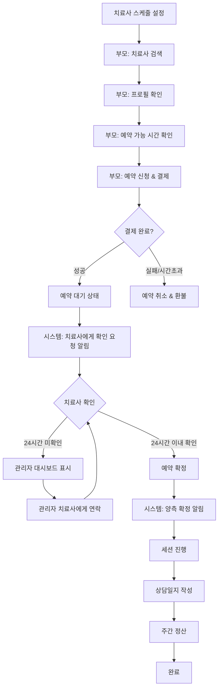

# 치료사 예약 시스템 통합 Workflow

## 📚 문서 구조

치료사 예약 시스템의 전체 워크플로우를 업무별로 분리하여 관리합니다.

| 문서 | 내용 | 대상 |
|------|------|------|
| [01_PROCESS_FLOW.md](./01_PROCESS_FLOW.md) | 역할별 상세 플로우 | 개발자, PM |
| [02_USE_CASES.md](./02_USE_CASES.md) | 세부 시나리오와 사용 사례 | PM, QA |
| [03_DATA_MODELS.md](./03_DATA_MODELS.md) | 데이터 구조 (Prisma Schema) | 백엔드 개발자 |
| [04_API_REFERENCE.md](./04_API_REFERENCE.md) | API 엔드포인트 명세 | 프론트엔드/백엔드 개발자 |
| [05_ERROR_HANDLING.md](./05_ERROR_HANDLING.md) | 예외 처리와 알림 시스템 | 개발자, 운영팀 |
| [06_DIAGRAMS.md](./06_DIAGRAMS.md) | 다이어그램과 체크리스트 | 전체 팀 |

## 🔄 전체 프로세스 개요

### 1.1 전체 흐름 요약

### 1.2 주요 단계별 소요 시간

| 단계 | 담당 | 소요 시간 | 비고 |
|------|------|-----------|------|
| 스케줄 일괄 생성 | 치료사 | 최초 1회 10분 | 3개월분 한번에 생성 |
| 휴일 관리 | 치료사 | 수시 1-2분 | 개인 휴일 추가 |
| 치료사 검색 | 부모 | 5-10분 | 필터링 사용 시 빠름 |
| 예약 신청 & 결제 | 부모 | 5-10분 | 결제 완료 시 대기 상태 |
| 치료사 예약 확인 | 치료사 | 24시간 이내 | 미확인 시 관리자 개입 |
| 세션 진행 | 치료사 | 50분 | 표준 세션 시간 |
| 상담일지 작성 | 치료사 | 10-15분 | 정산 조건 |
| 정산 처리 | 시스템 | 매주 자동 | 월요일 계산, 수요일 입금 |

## 🎯 핵심 기능

### 치료사
- 스케줄 관리 (일괄 생성/삭제)
- 예약 확인/거절
- 상담일지 작성
- 정산 내역 확인

### 부모
- 치료사 검색/필터링
- 예약 신청 및 결제
- 예약 조정 요청
- 클레임 신청

### 관리자
- 미확인 예약 관리
- 클레임 조정
- 정산 처리
- 치료사 승인

## 🔧 기술 스택

- **Frontend**: Next.js 15, TypeScript, Tailwind CSS
- **Backend**: Next.js API Routes, Prisma ORM
- **Database**: SQLite (개발), PostgreSQL (운영)
- **Payment**: 토스페이먼츠
- **Notification**: Firebase FCM, SendGrid

## 📋 Quick Links

- [치료사 온보딩 프로세스](./01_PROCESS_FLOW.md#치료사-온보딩)
- [예약 신청 플로우](./01_PROCESS_FLOW.md#부모-예약-플로우)
- [결제 처리](./02_USE_CASES.md#결제-시나리오)
- [예약 조정](./02_USE_CASES.md#예약-조정)
- [클레임 처리](./05_ERROR_HANDLING.md#클레임-시스템)
- [정산 시스템](./02_USE_CASES.md#정산-처리)

## 📝 Version

- **Version**: 1.5
- **Last Updated**: 2025-01-14
- **Status**: Production Ready

## 🤝 담당자

- **PM**: Product Manager
- **Backend**: Backend Team
- **Frontend**: Frontend Team
- **QA**: QA Team
- **Operations**: 운영팀